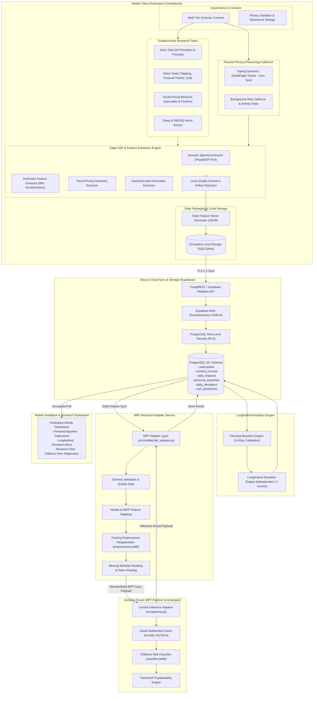

# MPF Mobile Extension — System Architecture Specification

**Multimodal Prodromal Fusion for Parkinson's Disease (MPF-PD)**  
*Digital Biomarker Collection & Longitudinal Monitoring Architecture*  
*Document Version: 1.0.0 | Status: APPROVED ARCHITECTURE SPECIFICATION*

---

> [!IMPORTANT]
> ### NON-NEGOTIABLE SAFETY & RESEARCH GOVERNANCE PRINCIPLES
> 1. **NO DIAGNOSTIC CLAIMS:** The system generates research screening estimates and baseline deviation trends. It **never diagnoses Parkinson's disease**. Standardized output terminology:
>    - *"Elevated Parkinson's risk pattern detected"* (never "You have Parkinson's")
>    - *"Your recent measurements differ from your personal baseline"* (never "Parkinson's progression")
>    - *"Research screening result — not a clinical diagnosis"*
>    - *"Progressive deviation from personal baseline"*
> 2. **NO SENSOR OVERCLAIMING:** The smartphone front camera is designated as the **Ocular/Visual Behavior Module**. It is **NOT** a retinal camera, cannot perform fundus/OCT imaging, and is not equivalent to retinal microvascular biomarkers.
> 3. **PRIVACY FIRST:** No keystroke text, passwords, or message contents are ever logged. No ambient background audio or camera capture is permitted. Edge computing extracts digital features locally before discarding raw sensor streams.
> 4. **EXISTING MPF PIPELINE PRESERVATION:** The existing MPF pipeline (`src/pipeline.py`, `models/fusion/`) remains unmodified. The mobile extension connects exclusively via an external adapter layer (`src/mobile/mpf_adapter.py`).

---

## 1. Executive Summary & Architectural Mission

The **MPF Mobile Extension** expands the existing MPF-PD multimodal prodromal risk screening framework into daily-life monitoring. While the core MPF pipeline evaluates cross-modal snapshots (olfactory UPSIT, RBDSQ sleep questionnaires, voice acoustics, motor kinematics, and retinal microvasculature), the Mobile Extension captures continuous, longitudinal digital biomarkers using consumer smartphone hardware.

Rather than attempting to replace clinical diagnostic equipment, the mobile architecture serves two critical research goals:
1. **Personal Baseline Deviation Tracking:** Establishing a personalized 14-day calibration profile for each participant and detecting progressive statistical deviations over time.
2. **Standardized MPF Feeding:** Transforming compatible mobile digital biomarkers into normalized feature representations that feed directly into the frozen, pre-trained MPF Multimodal Gated Fusion model without modifying model weights or schemas.

---

## 2. End-to-End System Architecture Diagram



---

## 3. Detailed Component Descriptions

### 3.1 Mobile Client Architecture
The mobile application is structured around a strict modular **Domain-Driven Design (DDD)** and **Clean Architecture (BLoC pattern)** implemented in Flutter (Dart) with native C/C++ and Kotlin/Swift bridges for real-time sensor processing.

```
mobile_app/
├── lib/
│   ├── app/                      # Application lifecycle & global configurations
│   ├── core/                     # Cryptography, networking, error handling, storage
│   ├── features/
│   │   ├── consent/              # Consent forms, version tracking, revocation
│   │   ├── typing_dynamics/      # Custom InputConnection interceptor (timing only)
│   │   ├── voice_task/           # Audio recording, real-time QC, acoustic DSP
│   │   ├── motor_task/           # Accelerometer/gyroscope, finger tapping, tremor
│   │   ├── ocular_behavior/      # Front-camera eye-tracking & saccade analysis
│   │   ├── sleep_survey/         # RBDSQ micro-forms & morning sleep check-in
│   │   ├── baseline_engine/      # On-device baseline cache and deviation viewer
│   │   └── dashboard/            # Trend visualization, safety notices, reports
│   └── shared/                   # UI components, design tokens, charts
```

#### Sensor Acquisition Modules
- **Typing Dynamics Interceptor:** Implements custom software keyboard or text input listeners that capture solely `down_time_ms` and `up_time_ms` timestamps. Character keys, Unicode values, and string content are discarded at the device hardware layer.
- **Voice Acoustic Task:** Prompts the user to hold a sustained vowel `/a/` for 5 seconds at a constant distance (15–20 cm). Audio is sampled uncompressed at 44.1 kHz, 16-bit PCM mono. Edge DSP extracts pitch perturbation quotients, harmonics-to-noise ratios, and spectral entropy directly in memory before deleting the raw buffer.
- **Motor & Kinematics Task:**
  - *Postural Tremor Test:* 10-second holding phone flat in palm with arm extended; IMU sampled at 100 Hz.
  - *Alternating Finger Tapping Test:* 10-second two-target alternating screen taps.
  - *Guided Gait Walk:* 20-second linear walking task with smartphone securely placed in pocket.
- **Ocular/Visual Behavior Module:** Front-facing camera guided visual fixation (3 seconds) and pro-saccadic target tracking (5 seconds). Extracts pupil position centroids and gaze vectors using on-device face mesh landmarks. Raw video frames are processed frame-by-frame in RAM and destroyed.
- **Sleep & RBDSQ Micro-Survey:** Digital administration of the 13-item validated REM Sleep Behavior Disorder Screening Questionnaire (RBDSQ) alongside daily morning sleep disturbance questions.

### 3.2 Digital Biomarker Extraction & Local Quality Control (QC)
All feature extraction occurs **locally on the device** whenever feasible:
- **Audio QC Gate:** Minimum SNR $\ge 15\text{ dB}$, audio duration $\ge 3.0\text{ s}$, clipping rate $< 1.0\%$.
- **Kinematic QC Gate:** Sensor frequency stability $\ge 95\text{ Hz}$, zero dropped frame rate $> 2.0\%$, orientation sanity check.
- **Gaze QC Gate:** Face detection confidence $\ge 0.85$, valid eye aspect ratio $> 0.15$.
- **Typing QC Gate:** Minimum keystroke count per session $\ge 50$.

Records failing local QC are rejected locally with immediate guided user feedback (e.g., *"Background noise was too loud — please try in a quieter room"*), preventing contaminated data from ever entering the processing pipeline.

### 3.3 Personal Baseline Engine (14-Day Baseline)
In compliance with **Non-Negotiable Rule 6 (Baseline-Centric Analysis)**:
- Upon enrollment, a participant enters a strict **14-day calibration window**.
- During this window, daily feature vectors are collected without computing population risk stratification.
- At Day 14, the baseline engine fits parametric ($\mu_i, \sigma_i$) and robust non-parametric (median, IQR) profiles across all features, along with a cross-feature covariance matrix $\mathbf{\Sigma}_{\text{base}}$.
- After calibration, the engine switches to an **adaptive rolling baseline** that tracks seasonal and chronic drift while isolating acute deviations.

### 3.4 Longitudinal Trend & Deviation Engine
For each post-baseline day $t$, the daily feature vector $\mathbf{x}_t$ is evaluated against the participant's historical baseline:
1. **Univariate Z-Scores:**
   $$z_{i, t} = \frac{x_{i, t} - \mu_{i, \text{base}}}{\sigma_{i, \text{base}}}$$
2. **Multivariate Mahalanobis Distance:**
   $$D_M(\mathbf{x}_t, \boldsymbol{\mu}_{\text{base}}) = \sqrt{(\mathbf{x}_t - \boldsymbol{\mu}_{\text{base}})^\top \mathbf{\Sigma}_{\text{base}}^{-1} (\mathbf{x}_t - \boldsymbol{\mu}_{\text{base}})}$$
3. **Statistical Significance Filter:** Persistent deviations exceeding $|z| \ge 2.5$ for 3 or more consecutive observation days trigger longitudinal notification alerts (e.g., *"Your recent motor measurements show progressive deviation from your personal baseline"*).

### 3.5 MPF Research Adapter Service
The adapter (`src/mobile/mpf_adapter.py`) runs as an asynchronous, stateless service:
- Fetches aggregated daily features from Supabase.
- Validates payload compliance against the MPF specification.
- Translates mobile features into the exact MPF feature schema.
- Feeds features into the existing `src.pipeline.run_mpf_pipeline()` entry point.
- Stores model outputs and exact SHAP attributions back into Supabase for research review.

---

## 4. Data Flow & Execution Sequence

```mermaid
sequenceDiagram
    autonumber
    actor Participant as Participant
    participant App as Mobile App
    participant EdgeQC as Local DSP & QC
    participant Supa as Supabase Cloud
    participant BaseEng as Baseline Engine
    participant Adapter as MPF Adapter
    participant CoreMPF as MPF Core Pipeline

    Note over Participant, App: Daily Collection Phase
    Participant->>App: Completes active tasks (voice, motor, visual, sleep)
    App->>EdgeQC: Stream raw sensor buffers in RAM
    EdgeQC->>EdgeQC: Extract tabular features & verify QC thresholds
    EdgeQC-->>App: Discard raw media; return validated features
    App->>App: Assemble Daily Feature Vector JSON

    Note over App, Supa: Secure Synchronization
    App->>Supa: Upsert to daily_features via TLS 1.3 + RLS
    Supa-->>App: Sync acknowledgment (201 Created)

    Note over Supa, BaseEng: Longitudinal Analysis
    Supa->>BaseEng: Trigger baseline check webhook
    alt Baseline Incomplete (< 14 days)
        BaseEng->>Supa: Update calibration progress (e.g. Day 8/14)
    else Baseline Complete (>= 14 days)
        BaseEng->>BaseEng: Compute personal Z-scores & Mahalanobis Distance
        BaseEng->>Supa: Write daily_deviations record
    end

    Note over Supa, CoreMPF: MPF Research Inference
    Supa->>Adapter: Scheduled trigger / event for daily batch
    Adapter->>Adapter: Map mobile features → MPF schema
    Adapter->>Adapter: Impute & Scale via preprocessor.joblib
    Adapter->>CoreMPF: run_mpf_pipeline(mapped_inputs)
    CoreMPF->>CoreMPF: Gated Neural Fusion + XGBoost Classifier + TreeSHAP
    CoreMPF-->>Adapter: Structured result (risk_score, gate_weights, explanation)
    Adapter->>Supa: Record in mpf_predictions

    Note over Supa, Participant: Visualization & Trend Review
    App->>Supa: Query daily_deviations & mpf_predictions
    Supa-->>App: Return personal longitudinal trends
    App->>Participant: Render baseline trajectory & deviation indicators
```

---

## 5. Technology Stack

| Layer | Component | Technology / Library | Rationale |
| :--- | :--- | :--- | :--- |
| **Mobile Client** | Cross-Platform App | Flutter 3.x (Dart 3.x) | Single codebase for iOS and Android; high-performance 60/120fps UI. |
| **Mobile Client** | Sensor Access | `sensors_plus`, `record`, `camera` | Standardized native hardware access plugins. |
| **Mobile Client** | Local Secure Storage | `sqflite_sqlcipher` (AES-256) | Encrypted on-device caching of sessions and offline queue. |
| **Mobile Edge DSP** | Audio Feature Extraction | Native C++ (`libsamplerate`, `kissfft`) via FFI | Low-latency pitch perturbation & spectral computation on device. |
| **Mobile Edge DSP** | Gaze / Visual Analysis | Google ML Kit Face Mesh | Robust 468-point 3D facial landmark tracking without cloud upload. |
| **Backend / DB** | Database & Storage | Supabase (PostgreSQL 15+) | Managed PostgreSQL, Row-Level Security, PostgREST APIs, JSONB indexing. |
| **Backend / Auth** | Authentication | Supabase Auth (JWT + UUID) | Secure participant authentication with pseudonymized identity keys. |
| **Backend / Compute**| Serverless Automation | Supabase Edge Functions (Deno/TS) | Lightweight triggers, aggregation routines, webhook dispatches. |
| **Adapter Service** | Adapter & Ingestion | Python 3.10+, FastAPI, Pydantic v2 | High-speed schema validation and seamless bridge to scientific Python stack. |
| **Existing ML Core** | Multimodal Fusion | PyTorch 2.x, Joblib, Scikit-Learn | Frozen, pre-trained neural gated attention network and preprocessors. |
| **Existing ML Core** | Risk Classifier | XGBoost (`XGBClassifier`) | Frozen gradient boosted decision trees for risk score generation. |
| **Existing ML Core** | Explainability | SHAP (`TreeExplainer`) | Exact mathematical Shapley value feature attribution. |

---

## 6. Integration Points with Existing MPF Pipeline

The Mobile Extension integrates with the existing MPF project exclusively through clean, documented, frozen interfaces:

1. **`src.pipeline.run_mpf_pipeline(inputs: Dict[str, Any]) -> Dict[str, Any]`**
   - The central entry point. Accepts participant age, sex, and sub-dictionaries for each modality.
   - Handled gracefully: Modalities without mobile sensors (olfactory, retinal imaging) are passed with `available: False`, triggering MPF's learnable missing token and dynamic gated masking mechanism.
2. **`models/fusion/preprocessor.joblib`**
   - Modality imputers and standard scalers fitted during Phase 6 training. Reused directly by the adapter to guarantee zero distribution shift.
3. **`models/fusion/classifier.joblib` & `models/fusion/fusion_encoder.pt`**
   - Frozen model checkpoints loaded strictly in evaluation mode (`torch.no_grad()`). Zero weights are modified or retrained.
4. **`models/fusion/metadata.json`**
   - Referenced to ensure model version compatibility (`gated_multimodal_fusion_v1`) and audit reproducibility.

---

## 7. Security, Privacy & Integrity Model

- **Zero Diagnostic Liability:** All visual displays, exports, and research summaries carry mandatory disclaimer text: *"Investigational Research Prototype — Not for Clinical Diagnosis"*.
- **Cryptographic Isolation:** Each participant is assigned a random UUIDv4 at onboarding. No national ID, email, or telephone number is linked to sensor or feature tables.
- **Row-Level Security (RLS):** Supabase database policies restrict access such that an authenticated participant token can only query rows where `participant_id == auth.uid()`.
- **Egress Boundary:** Raw sensor data (audio recordings, camera frames, keystroke text) never crosses the local device boundary. Only derived statistical aggregates and digital biomarkers are transmitted over TLS 1.3.
