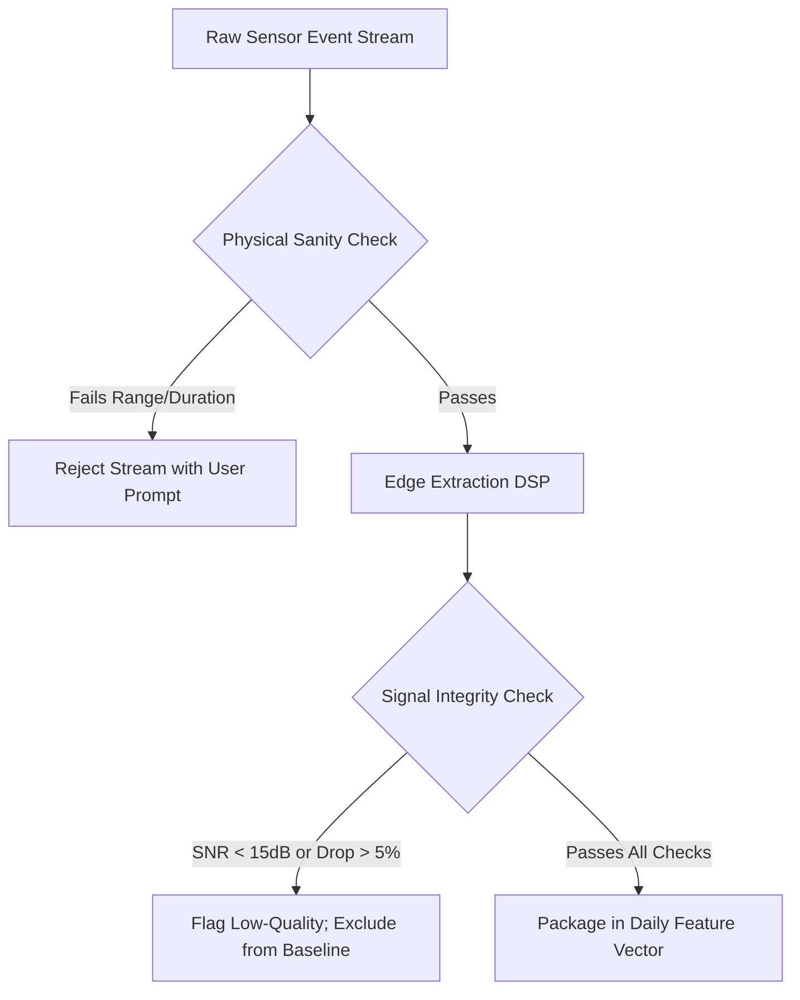

# MPF Mobile Extension — Digital Biomarker & Mobile Data Schema

**Multimodal Prodromal Fusion for Parkinson's Disease (MPF-PD)**  
*Feature Specification, Quality Gates, and Standardized Data Contracts*  
*Document Version: 1.0.0 | Status: APPROVED SPECIFICATION*

---

> [!IMPORTANT]
> ### PRIVACY & SENSOR SAFETY COMPLIANCE
> - **ZERO TEXT CAPTURE:** Typing dynamics measures solely inter-key timing intervals ($\Delta t$ in milliseconds). Keystroke character codes, key labels, text strings, and passwords are **strictly prohibited and never recorded**.
> - **NO SENSOR OVERCLAIMING:** The smartphone front-camera module is formally designated as the **Ocular/Visual Behavior Module**. It measures gaze kinematics and saccadic dynamics. It is **NOT** a retinal camera and does not assess microvascular morphology.
> - **RESEARCH SCREENING ONLY:** All schemas and outputs are investigational research representations. They carry **zero clinical diagnostic validity**.

---

## 1. Modality Feature Schemas

### 1.1 Typing Dynamics Module (Passive & Active)
Captures motor-cognitive degradation and finger dexterity through micro-timing variations during smartphone keyboard interaction.

| Feature Identifier | Data Type | Units | Valid Range | Missingness / Default Strategy | Description & Physiological Context |
| :--- | :---: | :---: | :---: | :--- | :--- |
| `hold_time_mean` | `float` | ms | $[20.0, 500.0]$ | Session median if count $\ge 30$; else null | Mean duration a key is held down (key-down to key-up). |
| `hold_time_std` | `float` | ms | $[0.0, 200.0]$ | Null if count $< 30$ | Standard deviation of key hold durations. |
| `flight_time_mean` | `float` | ms | $[10.0, 1500.0]$ | Session median if count $\ge 30$; else null | Mean latency between releasing one key and pressing the next. |
| `flight_time_std` | `float` | ms | $[0.0, 500.0]$ | Null if count $< 30$ | Variability in transition flight latencies. |
| `press_press_latency_mean`| `float` | ms | $[50.0, 2000.0]$ | Derived: `hold_time_mean` + `flight_time_mean` | Mean interval between consecutive key presses. |
| `typing_speed_cpm` | `float` | char/min | $[10.0, 600.0]$ | Imputed with user rolling mean | Keystrokes per minute across active typing bursts. |
| `error_correction_rate` | `float` | ratio | $[0.0, 1.0]$ | $0.0$ if no corrections observed | Ratio of backspace/delete events to total keystrokes. |
| `iki_cv_pct` | `float` | % | $[0.0, 150.0]$ | Null if count $< 30$ | Inter-key interval coefficient of variation ($(\sigma / \mu) \times 100$). |
| `keystroke_count` | `int` | count | $[0, 50000]$ | Mandatory integer | Total keystroke count in observation period. |
| `typing_entropy` | `float` | bits | $[0.0, 8.0]$ | Null if count $< 50$ | Shannon entropy of timing intervals (rhythm regularity). |

---

### 1.2 Voice Acoustic Module (Active Sustained Phonation & Reading)
Active voice tasks prompt the participant to record a sustained vowel `/a/` for 5 seconds and read a standardized phonetically balanced phonation prompt.

| Feature Identifier | Existing MPF Name | Data Type | Units | Valid Range | Preprocessing / Transform | Description |
| :--- | :--- | :---: | :---: | :---: | :--- | :--- |
| `jitter_pct` | `jitter_pct` | `float` | % | $[0.0001, 0.05]$ | Log-transform ($\log_e(x)$) | Local cycle-to-cycle frequency perturbation percentage. |
| `jitter_abs` | `jitter_abs` | `float` | $\mu\text{s}$ | $[1.0, 500.0]$ | Log-transform | Absolute frequency perturbation in microseconds. |
| `jitter_rap` | `jitter_rap` | `float` | ratio | $[0.0001, 0.04]$ | Direct standard scaling | Relative average perturbation across 3 periods. |
| `jitter_ppq5` | `jitter_ppq5` | `float` | ratio | $[0.0001, 0.04]$ | Direct standard scaling | Five-point period perturbation quotient. |
| `jitter_ddp` | `jitter_ddp` | `float` | ratio | $[0.0001, 0.12]$ | Derived ($3 \times \text{jitter\_rap}$) | Difference of differences between consecutive periods. |
| `shimmer` | `shimmer` | `float` | ratio | $[0.001, 0.30]$ | Log-transform | Local cycle-to-cycle amplitude perturbation. |
| `shimmer_db` | `shimmer_db` | `float` | dB | $[0.01, 3.0]$ | Direct standard scaling | Amplitude perturbation in decibels ($20 \log_{10}(A_{i+1}/A_i)$). |
| `shimmer_apq3` | `shimmer_apq3` | `float` | ratio | $[0.001, 0.20]$ | Direct standard scaling | Three-point amplitude perturbation quotient. |
| `shimmer_apq5` | `shimmer_apq5` | `float` | ratio | $[0.001, 0.25]$ | Direct standard scaling | Five-point amplitude perturbation quotient. |
| `shimmer_apq11`| `shimmer_apq11`| `float` | ratio | $[0.001, 0.30]$ | Direct standard scaling | Eleven-point amplitude perturbation quotient. |
| `shimmer_dda` | `shimmer_dda` | `float` | ratio | $[0.001, 0.60]$ | Derived ($3 \times \text{shimmer\_apq3}$) | Average absolute difference between consecutive amplitudes. |
| `nhr` | `nhr` | `float` | ratio | $[0.0001, 0.80]$ | Log-transform | Noise-to-harmonics ratio in phonation spectrum. |
| `hnr` | `hnr` | `float` | dB | $[0.0, 45.0]$ | Direct standard scaling | Harmonics-to-noise ratio (signal purity). |
| `rpde` | `rpde` | `float` | score | $[0.0, 1.0]$ | Direct standard scaling | Recurrence period density entropy (non-linear voice dynamics). |
| `dfa` | `dfa` | `float` | score | $[0.2, 1.5]$ | Direct standard scaling | Detrended fluctuation analysis fractal scaling exponent. |
| `ppe` | `ppe` | `float` | score | $[0.0, 1.0]$ | Direct standard scaling | Pitch period entropy (instability on logarithmic pitch scale). |
| `f0_mean_hz` | *Mobile exclusive* | `float` | Hz | $[60.0, 400.0]$ | Normalized by participant baseline | Mean fundamental vocal pitch frequency. |

---

### 1.3 Motor & Kinematics Module (Active Walking, Tapping & Tremor)
Evaluates motor slowing (bradykinesia), rhythm irregularity, and resting/postural tremors via phone IMU and capacitive touchscreen.

| Feature Identifier | Existing MPF Name | Data Type | Units | Valid Range | Translation / Extraction Mechanism | Description |
| :--- | :--- | :---: | :---: | :---: | :--- | :--- |
| `gait_speed_m_per_s` | `gait_speed_m_per_s` | `float` | m/s | $[0.2, 2.5]$ | Estimated via Weinberg/Kim step-length model + cadence | Linear overground walking velocity. |
| `cadence_steps_per_min`| `cadence_steps_per_min`| `float` | steps/min | $[40.0, 160.0]$ | Dominant peak in vertical acceleration autocorrelation | Walking frequency in steps per minute. |
| `stride_interval_mean_s`| `stride_interval_mean_s`| `float` | s | $[0.4, 2.5]$ | Derived ($120.0 / \text{cadence}$) | Mean duration between successive footfalls. |
| `stride_interval_cv_pct`| `stride_interval_cv_pct`| `float` | % | $[0.5, 25.0]$ | Coefficient of variation across step cycles | Stride timing variability index. |
| `step_regularity` | `step_regularity` | `float` | score | $[0.0, 1.0]$ | Unbiased autocorrelation peak at lag $T_{\text{step}}$ | Gait rhythm regularity and pattern repeatability. |
| `symmetry_index_pct` | `symmetry_index_pct` | `float` | % | $[0.0, 40.0]$ | Phase difference between consecutive bilateral strikes | Asymmetry between left and right stride phases. |
| `accel_variance` | `accel_variance` | `float` | $\text{m}^2/\text{s}^4$ | $[0.01, 3.0]$ | Variance of filtered vertical acceleration vector | Total energy expenditure and force fluctuation. |
| `stance_swing_ratio` | `stance_swing_ratio` | `float` | ratio | $[0.8, 3.5]$ | Biomechanical model of foot contact duration | Ratio of ground contact phase to flight phase. |
| `tremor_freq_dominant_hz`| *Mobile exclusive* | `float` | Hz | $[2.0, 12.0]$ | FFT spectral peak in 10-second postural test | Dominant tremor oscillation frequency. |
| `tremor_pd_band_power_ratio`| *Mobile exclusive* | `float` | ratio | $[0.0, 1.0]$ | Spectral power in 3.5–7.0 Hz band / total power (1–15 Hz) | Classic Parkinsonian resting/postural tremor band concentration. |
| `tapping_intertap_cv_pct`| *Mobile exclusive* | `float` | % | $[1.0, 50.0]$ | Inter-tap interval CV in two-finger alternation | Finger dexterity and fine motor timing rhythm. |

---

### 1.4 Ocular / Visual Behavior Module (Front Camera Gaze Tracking)
Evaluates saccadic latency, smooth pursuit stability, and blink micro-kinematics using on-device computer vision face mesh detection.

> [!CAUTION]
> **NOT RETINAL BIOMARKERS:** This module does **NOT** image the retina, optic disc, or retinal microvasculature. It does not replace fundus imaging or optical coherence tomography (OCT). These features remain distinct and are tracked strictly as complementary behavioral indicators.

| Feature Identifier | Data Type | Units | Valid Range | Quality Requirement | Description |
| :--- | :---: | :---: | :---: | :--- | :--- |
| `saccade_latency_mean_ms` | `float` | ms | $[100.0, 600.0]$ | $\ge 8$ valid target saccades | Mean reaction latency between visual stimulus jump and onset of rapid eye movement. |
| `saccade_peak_velocity_deg_s`| `float` | deg/s | $[150.0, 800.0]$ | Main sequence linearity check | Peak angular velocity achieved during horizontal target-directed saccades. |
| `saccade_amplitude_error_pct`| `float` | % | $[0.0, 50.0]$ | Validated calibration grid | Degree of saccadic hypometria (undershooting target amplitude). |
| `fixation_stability_bcea` | `float` | $\text{deg}^2$ | $[0.05, 5.0]$ | 3-second continuous fixation | Bivariate Contour Ellipse Area measuring involuntary gaze drift and square-wave jerks. |
| `blink_rate_per_min` | `float` | blinks/min | $[2.0, 45.0]$ | Eye aspect ratio confidence $> 0.9$ | Spontaneous blink frequency (often reduced in hypomimia). |
| `gaze_smooth_pursuit_gain` | `float` | ratio | $[0.3, 1.2]$ | Continuous target pursuit | Ratio of smooth pursuit eye velocity to target stimulus velocity. |

---

### 1.5 REM Sleep Behavior Disorder (RBD) & Sleep Module
Digital implementation of the 13-item validated RBDSQ questionnaire with morning subjective sleep tracking.

| Feature Identifier | Existing MPF Name | Data Type | Valid Range | Transformation | Description |
| :--- | :--- | :---: | :---: | :--- | :--- |
| `rbdsq_total` | `rbdsq_total` | `float` | $[0, 13]$ | Exact sum of items | Total affirmative score on RBDSQ screening questionnaire. |
| `above_cutoff_flag` | `above_cutoff_flag` | `float` | $\{0.0, 1.0\}$ | $1.0$ if $\text{rbdsq\_total} \ge 5.0$; else $0.0$ | Standard clinical research screening cutoff flag. |
| `high_weight_item_flags`| `high_weight_item_flags`| `float` | $\{0.0, 1.0\}$ | $1.0$ if items $(1 + 6 + 7) \ge 2.0$; else $0.0$ | Composite indicator for aggressive dream enactment behavior. |
| `item_1` through `item_13` | `item_1` .. `item_13` | `float` | $\{0.0, 1.0\}$ | Direct binary questionnaire responses | Individual binary responses to validated RBDSQ questions. |
| `sleep_duration_hours` | *Mobile exclusive* | `float` | $[2.0, 14.0]$ | Participant reported duration | Self-reported total nighttime sleep duration. |
| `nocturnal_awakenings` | *Mobile exclusive* | `int` | $[0, 15]$ | Participant reported count | Count of nighttime awakenings reported in morning survey. |

---

## 2. Quality Control (QC) Gates & Validation Rules

Each data stream is evaluated against strict physical and mathematical sanity thresholds before inclusion in the daily feature vector:



### 2.1 Modality Quality Gate Criteria

1. **Voice Phonation Task:**
   - Sampling rate strictly $44.1\text{ kHz}$ or $48\text{ kHz}$, 16-bit linear PCM.
   - Signal-to-Noise Ratio (SNR) $> 15.0\text{ dB}$.
   - Uninterrupted phonation duration $\ge 3.0\text{ seconds}$.
   - Zero-crossing rate stability check; amplitude clipping fraction $< 0.5\%$.
2. **Motor Gait & Kinematics Task:**
   - Continuous IMU sampling frequency $\ge 90\text{ Hz}$ (target $100\text{ Hz}$).
   - Missing sample interpolation rate $< 2.0\%$.
   - Participant walking detection: minimum continuous steps $\ge 15$.
3. **Ocular / Visual Behavior Task:**
   - Front camera frame rate $\ge 30\text{ fps}$.
   - Facial landmark confidence $\ge 0.85$ across $\ge 85\%$ of task frames.
   - Ambient illuminance check: reject if mean pixel luminance $< 40$ (under-exposed) or $> 240$ (over-exposed).
4. **Typing Dynamics:**
   - Active typing session keystroke count $\ge 50$.
   - Rejection of synthetic/automated inputs (inter-key intervals $< 15\text{ ms}$).

---

## 3. Daily Feature Vector Standardized JSON Specification

The mobile client packages all validated measurements into a standardized, versioned JSON payload transmitted daily to Supabase:

```json
{
  "$schema": "https://mpf-research.org/schemas/v1/daily_features.json",
  "participant_id": "a6b7c8d9-e0f1-4a2b-8c3d-e4f5a6b7c8d9",
  "feature_date": "2026-09-24",
  "client_metadata": {
    "app_version": "1.0.0",
    "feature_schema_version": "1.0.0",
    "device_manufacturer": "Google",
    "device_model": "Pixel 8",
    "os_version": "Android 15",
    "timezone": "America/New_York",
    "collection_timestamp_utc": "2026-09-24T14:32:00Z"
  },
  "modality_availability": {
    "voice": true,
    "motor": true,
    "typing": true,
    "visual_behavior": true,
    "sleep_survey": true,
    "olfactory": false,
    "retina": false
  },
  "quality_scores": {
    "voice_snr_db": 22.4,
    "motor_sampling_stability_pct": 99.2,
    "visual_face_confidence": 0.94,
    "typing_keystrokes_evaluated": 342,
    "overall_daily_quality_index": 0.96
  },
  "features": {
    "voice": {
      "jitter_pct": 0.0052,
      "jitter_abs": 28.5,
      "jitter_rap": 0.0028,
      "jitter_ppq5": 0.0031,
      "jitter_ddp": 0.0084,
      "shimmer": 0.038,
      "shimmer_db": 0.33,
      "shimmer_apq3": 0.017,
      "shimmer_apq5": 0.021,
      "shimmer_apq11": 0.029,
      "shimmer_dda": 0.051,
      "nhr": 0.028,
      "hnr": 19.8,
      "rpde": 0.48,
      "dfa": 0.71,
      "ppe": 0.22,
      "f0_mean_hz": 128.4
    },
    "motor": {
      "gait_speed_m_per_s": 1.12,
      "cadence_steps_per_min": 104.5,
      "stride_interval_mean_s": 1.148,
      "stride_interval_cv_pct": 3.1,
      "step_regularity": 0.79,
      "symmetry_index_pct": 6.2,
      "accel_variance": 0.36,
      "stance_swing_ratio": 1.62,
      "tremor_freq_dominant_hz": 4.8,
      "tremor_pd_band_power_ratio": 0.24,
      "tapping_intertap_cv_pct": 8.4
    },
    "typing": {
      "hold_time_mean": 94.2,
      "hold_time_std": 18.5,
      "flight_time_mean": 142.0,
      "flight_time_std": 38.4,
      "press_press_latency_mean": 236.2,
      "typing_speed_cpm": 254.0,
      "error_correction_rate": 0.045,
      "iki_cv_pct": 22.8,
      "keystroke_count": 342,
      "typing_entropy": 4.12
    },
    "visual_behavior": {
      "saccade_latency_mean_ms": 224.0,
      "saccade_peak_velocity_deg_s": 412.0,
      "saccade_amplitude_error_pct": 8.5,
      "fixation_stability_bcea": 0.82,
      "blink_rate_per_min": 14.2,
      "gaze_smooth_pursuit_gain": 0.88
    },
    "sleep_survey": {
      "rbdsq_total": 4.0,
      "above_cutoff_flag": 0.0,
      "high_weight_item_flags": 0.0,
      "item_1": 0.0,
      "item_2": 1.0,
      "item_3": 0.0,
      "item_4": 0.0,
      "item_5": 0.0,
      "item_6": 0.0,
      "item_7": 1.0,
      "item_8": 0.0,
      "item_9": 1.0,
      "item_10": 0.0,
      "item_11": 0.0,
      "item_12": 1.0,
      "item_13": 0.0,
      "sleep_duration_hours": 7.2,
      "nocturnal_awakenings": 1
    }
  }
}
```

---

## 4. Mobile-to-MPF Feature Mapping Table

This table specifies the exact operational translation between mobile daily features and the inputs required by the existing MPF multimodal fusion model:

| Target MPF Modality | Target Feature Name | Source Mobile Feature | Mathematical Transformation | Direct Equivalence Confidence |
| :--- | :--- | :--- | :--- | :---: |
| **Voice** ($D=16$) | `jitter_pct` .. `ppe` (All 16) | `features.voice.*` | Direct $1:1$ numerical mapping | **High ($100\%$)** — Exact acoustic algorithm match. |
| **Motor** ($D=8$) | `gait_speed_m_per_s` | `features.motor.gait_speed_m_per_s` | Direct $1:1$ numerical mapping | **High ($95\%$)** — Biomechanical step estimation. |
| **Motor** ($D=8$) | `cadence_steps_per_min` | `features.motor.cadence_steps_per_min` | Direct $1:1$ numerical mapping | **Very High ($98\%$)** — Accelerometer step autocorrelation. |
| **Motor** ($D=8$) | `stride_interval_mean_s`| `features.motor.stride_interval_mean_s` | Direct $1:1$ numerical mapping | **Very High ($98\%$)** |
| **Motor** ($D=8$) | `stride_interval_cv_pct`| `features.motor.stride_interval_cv_pct` | Direct $1:1$ numerical mapping | **High ($92\%$)** |
| **Motor** ($D=8$) | `step_regularity` | `features.motor.step_regularity` | Direct $1:1$ numerical mapping | **High ($92\%$)** |
| **Motor** ($D=8$) | `symmetry_index_pct` | `features.motor.symmetry_index_pct` | Direct $1:1$ numerical mapping | **High ($90\%$)** |
| **Motor** ($D=8$) | `accel_variance` | `features.motor.accel_variance` | Scaled to match physical IMU units | **High ($90\%$)** |
| **Motor** ($D=8$) | `stance_swing_ratio` | `features.motor.stance_swing_ratio` | Direct $1:1$ numerical mapping | **Medium-High ($85\%$)** |
| **RBD** ($D=16$) | `rbdsq_total` | `features.sleep_survey.rbdsq_total` | Direct $1:1$ numerical mapping | **Very High ($100\%$)** — Standard validated survey items. |
| **RBD** ($D=16$) | `above_cutoff_flag` | `features.sleep_survey.above_cutoff_flag` | Direct $1:1$ numerical mapping | **Very High ($100\%$)** |
| **RBD** ($D=16$) | `high_weight_item_flags`| `features.sleep_survey.high_weight_item_flags`| Direct $1:1$ numerical mapping | **Very High ($100\%$)** |
| **RBD** ($D=16$) | `item_1` .. `item_13` | `features.sleep_survey.item_1` .. `item_13` | Direct $1:1$ numerical mapping | **Very High ($100\%$)** |
| **Olfactory** ($D=5$) | *All 5 features* | *No Mobile Sensor* | **Marked Absent ($p_{\text{olf}} = 0$)** | **N/A** — Requires physical odorant booklet. |
| **Retina** ($D=28$) | *All 28 features* | *No Mobile Sensor* | **Marked Absent ($p_{\text{ret}} = 0$)** | **N/A** — Requires clinical fundus camera / OCT. |

---

## 5. Feature Versioning & Governance Policy

1. **Semantic Versioning (`MAJOR.MINOR.PATCH`):**
   - `MAJOR`: Structural changes, deleted features, or altered algorithmic feature definitions (e.g. moving from `v1.0.0` to `v2.0.0`).
   - `MINOR`: New optional features added without breaking existing mapping.
   - `PATCH`: Internal implementation bug fixes with zero change to mathematical output.
2. **Version Pinning in Ingestion:**
   Every row stored in `daily_features` records `feature_schema_version`. The MPF adapter validates this version against its compatibility registry before processing.
