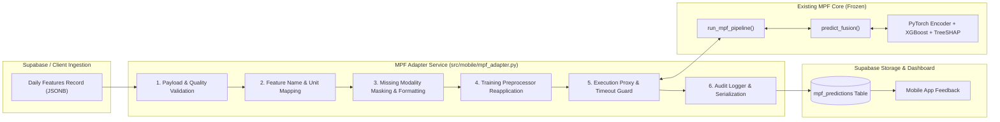
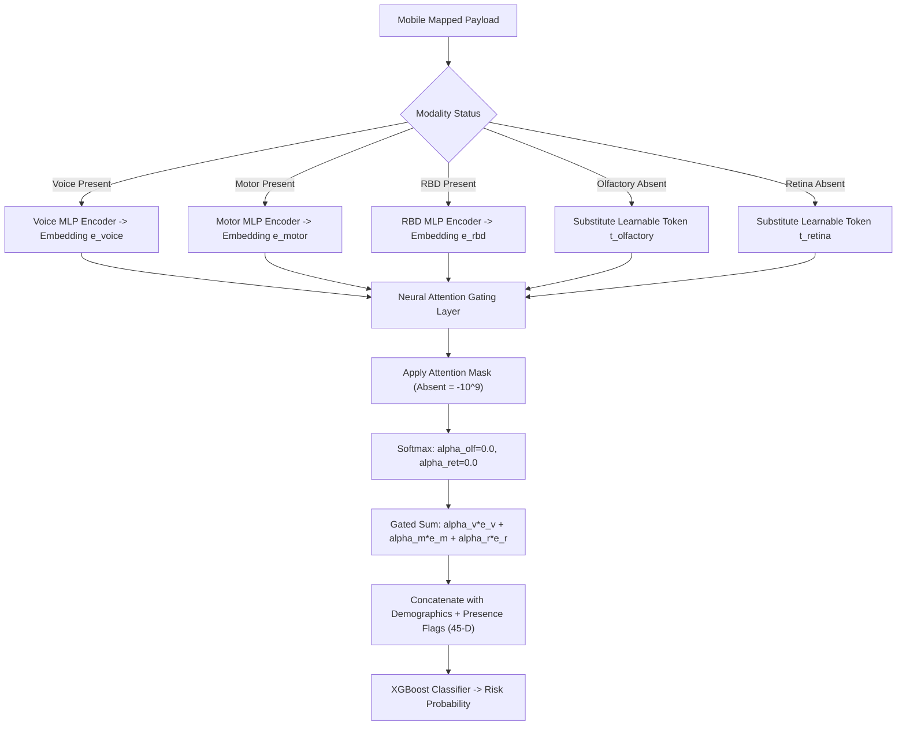

# MPF Mobile Extension — MPF Adapter Layer Specification

**Multimodal Prodromal Fusion for Parkinson's Disease (MPF-PD)**  
*Adapter Service Contract, Normalization Reuse, and Inference Proxy Architecture*  
*Target Module: `src/mobile/mpf_adapter.py` | Document Version: 1.0.0 | Status: APPROVED SPECIFICATION*

---

> [!IMPORTANT]
> ### EXISTING SYSTEM PRESERVATION RULES
> 1. **DO NOT MODIFY EXISTING MODELS:** The adapter acts as an external translation proxy. It imports and executes `src.pipeline.run_mpf_pipeline()`, but **never** alters model weights, architectures, or files in `models/` or `src/fusion/`.
> 2. **NO AUTOMATIC RETRAINING:** The adapter runs **inference only**. Retraining on mobile data is strictly separated into offline clinical protocols.
> 3. **USE TRAINING PREPROCESSING EXACTLY:** Normalization and imputation must use the serialized transformers in `models/fusion/preprocessor.joblib`. Never refit scalers on mobile samples.
> 4. **PRESERVE MODEL OUTPUTS UNCHANGED:** The model output dictionary, continuous risk probability, gate weights, and SHAP explainability attributions must be passed through faithfully without distortion or fabrication.

---

## 1. Adapter Architecture & Responsibilities

The MPF Adapter (`src/mobile/mpf_adapter.py`) serves as the operational bridge between the Mobile Data Collection subsystem and the existing MPF Multimodal Prodromal Screening Pipeline.



### Core Responsibilities
1. **Fetch & Ingest:** Retrieve un-inferred daily feature records from Supabase `daily_features`.
2. **Schema & Quality Validation:** Ensure incoming fields meet type, range, and QC requirements.
3. **Feature Translation:** Map mobile features to the exact names and units expected by MPF.
4. **Missing Modality Handling:** Explicitly mark unavailable modalities (`olfactory: available=False`, `retina: available=False`), activating the Gated Fusion Network's learnable missing tokens.
5. **Exact Normalization:** Apply `modality_imputers` and `modality_scalers` loaded from `models/fusion/preprocessor.joblib`.
6. **Inference Execution:** Invoke `src.pipeline.run_mpf_pipeline()` synchronously with timeout safeguards.
7. **Audit Logging & Storage:** Record model prediction, gate weights, fused representations, and exact TreeSHAP attributions in `mpf_predictions`.

---

## 2. Interface Contracts & Data Formats

### 2.1 Adapter Input Schema (From Mobile Daily Feature JSON)
```python
from typing import Dict, Any, List, Optional
from pydantic import BaseModel, Field

class VoiceFeatures(BaseModel):
    jitter_pct: float = Field(..., ge=0.0001, le=0.05)
    jitter_abs: float = Field(..., ge=1.0, le=500.0)
    jitter_rap: float = Field(..., ge=0.0001, le=0.04)
    jitter_ppq5: float = Field(..., ge=0.0001, le=0.04)
    jitter_ddp: float = Field(..., ge=0.0001, le=0.12)
    shimmer: float = Field(..., ge=0.001, le=0.30)
    shimmer_db: float = Field(..., ge=0.01, le=3.0)
    shimmer_apq3: float = Field(..., ge=0.001, le=0.20)
    shimmer_apq5: float = Field(..., ge=0.001, le=0.25)
    shimmer_apq11: float = Field(..., ge=0.001, le=0.30)
    shimmer_dda: float = Field(..., ge=0.001, le=0.60)
    nhr: float = Field(..., ge=0.0001, le=0.80)
    hnr: float = Field(..., ge=0.0, le=45.0)
    rpde: float = Field(..., ge=0.0, le=1.0)
    dfa: float = Field(..., ge=0.2, le=1.5)
    ppe: float = Field(..., ge=0.0, le=1.0)
    f0_mean_hz: Optional[float] = None

class MotorFeatures(BaseModel):
    gait_speed_m_per_s: float = Field(..., ge=0.2, le=2.5)
    cadence_steps_per_min: float = Field(..., ge=40.0, le=160.0)
    stride_interval_mean_s: float = Field(..., ge=0.4, le=2.5)
    stride_interval_cv_pct: float = Field(..., ge=0.5, le=25.0)
    step_regularity: float = Field(..., ge=0.0, le=1.0)
    symmetry_index_pct: float = Field(..., ge=0.0, le=40.0)
    accel_variance: float = Field(..., ge=0.01, le=3.0)
    stance_swing_ratio: float = Field(..., ge=0.8, le=3.5)

class SleepSurveyFeatures(BaseModel):
    rbdsq_total: float = Field(..., ge=0.0, le=13.0)
    above_cutoff_flag: float = Field(..., ge=0.0, le=1.0)
    high_weight_item_flags: float = Field(..., ge=0.0, le=1.0)
    item_1: Optional[float] = 0.0
    item_2: Optional[float] = 0.0
    item_3: Optional[float] = 0.0
    item_4: Optional[float] = 0.0
    item_5: Optional[float] = 0.0
    item_6: Optional[float] = 0.0
    item_7: Optional[float] = 0.0
    item_8: Optional[float] = 0.0
    item_9: Optional[float] = 0.0
    item_10: Optional[float] = 0.0
    item_11: Optional[float] = 0.0
    item_12: Optional[float] = 0.0
    item_13: Optional[float] = 0.0

class MobileDailyPayload(BaseModel):
    participant_id: str
    feature_date: str
    age: float = Field(..., ge=18.0, le=120.0)
    sex: str = Field(..., regex="^(male|female|m|f|0|1)$")
    voice: Optional[VoiceFeatures] = None
    motor: Optional[MotorFeatures] = None
    sleep_survey: Optional[SleepSurveyFeatures] = None
    feature_schema_version: str = "1.0.0"
```

### 2.2 Standardized MPF Core Input Payload (Mapped by Adapter)
The adapter transforms the above into the exact payload expected by `src.pipeline.run_mpf_pipeline()`:

```python
mapped_mpf_input = {
    "participant_id": payload.participant_id,
    "age": payload.age,
    "sex": payload.sex,
    "olfactory": {
        "available": False  # Hardware absent on smartphones
    },
    "retina": {
        "available": False  # Front camera is NOT a retinal fundus/OCT camera
    },
    "voice": {
        "available": True if payload.voice else False,
        "features": payload.voice.dict(exclude={"f0_mean_hz"}) if payload.voice else {}
    },
    "motor": {
        "available": True if payload.motor else False,
        "features": payload.motor.dict() if payload.motor else {}
    },
    "rbd": {
        "available": True if payload.sleep_survey else False,
        "rbdsq_total": payload.sleep_survey.rbdsq_total if payload.sleep_survey else None,
        "item_responses": [
            payload.sleep_survey.__dict__.get(f"item_{i}", 0.0)
            for i in range(1, 14)
        ] if payload.sleep_survey else []
    }
}
```

---

## 3. Normalization & Preprocessing Protocol

To guarantee mathematical consistency with model training, the adapter applies the following strict rules:

1. **Direct Preprocessor Artifact Loading:**
   ```python
   import joblib
   preprocessor = joblib.load("models/fusion/preprocessor.joblib")
   modality_scalers = preprocessor["modality_scalers"]
   modality_imputers = preprocessor["modality_imputers"]
   demo_scaler = preprocessor["demo_scaler"]
   demo_imputer = preprocessor["demo_imputer"]
   ```
2. **Strict Transformation Without Fitting:**
   - Call only `transform()`. **Never** call `fit()` or `fit_transform()`.
   - Feature columns must be passed in the exact order recorded in `preprocessor["modality_feature_cols"]`.
3. **Outlier Boundaries:**
   Extreme physiological artifacts exceeding $\pm 5$ standard deviations from the training distribution are clipped at $[-5.0, +5.0]$ in scaled space to prevent numerical instability.

---

## 4. Missing Modality Handling Mechanism

In real-world mobile monitoring, participants frequently complete only a subset of tasks on any given day. Furthermore, **olfactory and retinal modalities are always absent in mobile collection**:



- When `olfactory.available = False` and `retina.available = False`:
  - `p_olf = 0` and `p_ret = 0`.
  - Attention scores $s'_{\text{olf}} = -10^9$ and $s'_{\text{ret}} = -10^9$.
  - Softmax weights $\alpha_{\text{olf}} = 0.0000$ and $\alpha_{\text{ret}} = 0.0000$.
  - Only present mobile modalities ($\alpha_{\text{voice}} + \alpha_{\text{motor}} + \alpha_{\text{rbd}} = 1.0$) determine the gated latent vector $\mathbf{z}_{\text{gated}}$.
- If all mobile modalities fail QC on a given day:
  - Adapter returns status `skipped_no_modalities_available` without invoking the fusion classifier.

---

## 5. Error Handling, Timeouts & Graceful Fallbacks

| Error Scenario | Root Cause | Adapter Response | Fallback Action |
| :--- | :--- | :--- | :--- |
| **Missing Model Artifact** | `classifier.joblib` or `fusion_encoder.pt` missing | Raise `ModelNotFoundError` | Log critical alert; store error status in DB; do not crash service. |
| **Schema Validation Error** | Invalid types, out-of-range sensor values | Return `ValidationResult(valid=False)` | Skip inference; flag record as `failed_qc` with validation message. |
| **Inference Timeout** | Model evaluation takes $> 5000\text{ ms}$ | Abort execution via signal/thread timer | Log timeout event; retry with exponential backoff up to 2 times. |
| **Extreme Missingness** | 0 modalities valid for the day | Return `status="no_data"` | Do not run inference; record neutral daily log entry. |
| **NaN in Prediction** | Numerical instability in custom feature | Catch `ValueError` | Substitute baseline neutral risk `0.5` with explicit warning flag. |

---

## 6. Version Compatibility Matrix

| Mobile Schema Version | Adapter Version | MPF Pipeline Version | Fusion Model Version | Status |
| :---: | :---: | :---: | :---: | :--- |
| `1.0.0` | `1.0.0` | `0.9.0` | `gated_multimodal_fusion_v1` | **Fully Compatible (Production)** |
| `< 1.0.0` | `1.0.0` | `0.9.0` | `gated_multimodal_fusion_v1` | **Deprecated / Requires Migration** |
| `> 1.0.0` | `1.0.0` | `0.9.0` | `gated_multimodal_fusion_v1` | **Blocked / Ingestion Rejected** |

---

## 7. Adapter API & REST Interface Specification (Phase 16)

### 7.1 Python Class Interface: `MPFAdapter`
```python
from src.mobile.mpf_adapter import MPFAdapter

adapter = MPFAdapter(
    supabase_client=None,                 # Optional supabase client
    preprocessor_path="models/fusion/preprocessor.joblib",
    log_file_path="logs/mobile_predictions.jsonl",
)

result = adapter.run_inference(
    mobile_daily_features={...},          # typing, voice, motor, visual, sleep
    baseline_deviation_context={...},     # z_scores, mahalanobis_distance, status
    demographics={"age": 65.0, "sex": "male"},
    feature_date="2026-09-23",
    log_to_db=True,
    raw_feature_version="1.0.0",
    processing_version="1.0.0",
    baseline_version="1.0.0",
    app_version="1.0.0",
)
```

### 7.2 FastAPI REST Endpoint: `POST /api/mobile/analyze`
- **Method:** `POST`
- **Path:** `/api/mobile/analyze`
- **Headers:** `Content-Type: application/json`
- **Request Body (`MobileAnalysisRequest`):**
```json
{
  "participant_id": "P016",
  "features": {
    "typing": { "typing_speed": 3.8, "interval_variability": 0.15, "correction_rate": 0.08 },
    "voice": { "jitter": 0.012, "shimmer": 0.06, "hnr": 15.0, "pitch_mean": 140.0 },
    "motor": { "cadence": 92.0, "stride_variability": 4.5, "tapping_rate": 4.0 },
    "sleep": { "rbdsq_total": 5.0, "unusual_movement_self_report": 1.0 }
  },
  "baseline_deviation_context": {
    "baseline_version": "1.0.0",
    "mahalanobis_distance": 2.1,
    "significant_deviations": ["voice.jitter", "motor.cadence"]
  },
  "demographics": { "age": 68.0, "sex": "male" },
  "log_to_db": false,
  "raw_feature_version": "1.0.0",
  "app_version": "1.0.0"
}
```
- **Response Body (`MobileAnalysisResponse`):**
```json
{
  "risk_score": 0.8124,
  "status": "success",
  "risk_pattern": "Elevated Parkinson's risk pattern detected",
  "available_modalities": ["voice", "motor", "rbd"],
  "missing_modalities": ["olfactory", "retina"],
  "model_version": "gated_multimodal_fusion_v1",
  "prediction_metadata": {
    "source": "mobile_extension",
    "feature_mapping_version": "1.0.0",
    "feature_version": "1.0.0",
    "raw_feature_version": "1.0.0",
    "processing_version": "1.0.0",
    "baseline_version": "1.0.0",
    "model_version": "gated_multimodal_fusion_v1",
    "app_version": "1.0.0",
    "baseline_deviation_context": { ... },
    "timestamp": "2026-09-23T18:00:00+00:00",
    "disclaimer": "Research screening result — not a clinical diagnosis.",
    "risk_pattern": "Elevated Parkinson's risk pattern detected"
  },
  "gate_weights": { "voice": 0.38, "motor": 0.35, "rbd": 0.27 },
  "explanation": {
    "important_modalities": [
      { "modality": "voice", "importance": 0.38, "missing": false },
      { "modality": "motor", "importance": 0.35, "missing": false },
      { "modality": "rbd", "importance": 0.27, "missing": false },
      { "modality": "olfactory", "importance": 0.0, "missing": true },
      { "modality": "retina", "importance": 0.0, "missing": true }
    ]
  },
  "warnings": [...]
}
```

