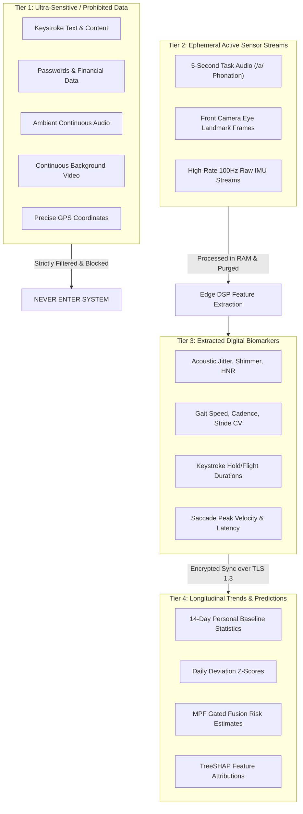
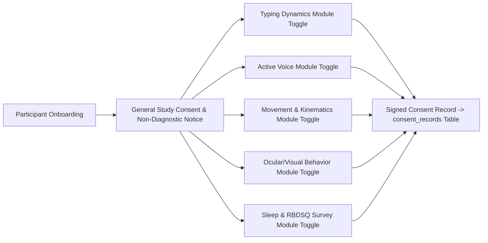

# MPF Mobile Extension — Privacy, Security & Governance Model

**Multimodal Prodromal Fusion for Parkinson's Disease (MPF-PD)**  
*Privacy-Preserving Sensor Architecture, Data Classification, Encryption, and Governance*  
*Document Version: 1.0.0 | Status: APPROVED SPECIFICATION*

---

> [!IMPORTANT]
> ### CORE PRIVACY & ETHICAL DIRECTIVES
> 1. **ZERO TEXT & CONTENT LOGGING:** The typing dynamics module records **exclusively keystroke timing intervals** ($\Delta t$ in milliseconds). Keystroke character values, Unicode symbols, words, text messages, passwords, and form entries are **categorically never recorded, processed, or stored**.
> 2. **NO CONTINUOUS SENSING:** Ambient background audio listening and continuous camera surveillance are strictly prohibited. Sensitive sensors activate **only** during explicit, user-initiated, visibly guided active research tasks.
> 3. **EDGE-FIRST FEATURE EXTRACTION:** Audio recordings and camera frames are processed directly in volatile device memory (RAM). Once mathematical features (e.g. jitter, saccadic latency) are extracted, **the raw audio and video buffers are immediately purged from memory**.
> 4. **ZERO DIAGNOSTIC LIABILITY:** All patient-facing screens and exported summaries feature prominent disclaimers: *"Investigational research prototype — not a clinical diagnosis."*

---

## 1. Data Classification Hierarchy

Data collected or produced by the MPF Mobile Extension is classified into four distinct security tiers with escalating safeguards:



| Security Tier | Description | Retention Window | Storage Location | Transmission Protocol |
| :--- | :--- | :---: | :---: | :---: |
| **Tier 1 (Prohibited)** | Character text, passwords, ambient microphone, background camera, GPS. | **0 seconds (Never stored)** | N/A | **Never transmitted** |
| **Tier 2 (Ephemeral)** | Raw 5s audio buffer, 100Hz IMU buffers, face video frames during active tasks. | **$< 5$ seconds (Purged post-DSP)** | Device RAM only | **Never transmitted by default** |
| **Tier 3 (Biomarkers)** | Tabular scalar features (e.g. `jitter_pct`, `gait_speed_m_per_s`, `hold_time_mean`). | **Local: 90 days; Cloud: Study duration** | Encrypted SQLite (client) & Supabase | Encrypted (TLS 1.3 + Certificate Pinning) |
| **Tier 4 (Aggregates)** | Daily feature vectors, baseline profiles, deviation Z-scores, MPF predictions. | **Study duration + 5 years (Regulatory)** | Supabase PostgreSQL | Encrypted (TLS 1.3) |

---

## 2. Granular, Multi-Tier Informed Consent Model

The mobile client enforces an interactive, multi-tiered consent workflow during onboarding. Participants have fine-grained control to enable or revoke individual modality modules at any time without forfeiting participation in the study:



### Key Consent Principles
- **Affirmative Opt-In:** All sensor toggles default to disabled until the participant actively views an explanatory walkthrough of what features are extracted.
- **Plain-Language Explanations:**
  - *"Voice task: We record your voice for 5 seconds saying 'ahh'. We calculate sound stability and delete the recording immediately. We do not listen to your words."*
  - *"Typing task: We measure how fast you press and release keys. We never record what letters or words you type."*
  - *"Visual task: We track eye movements using the front camera. We do not store photos or video of your face."*
- **Instant Revocation:** A one-tap toggle in app settings immediately deactivates collection for that modality and halts data synchronization.

---

## 3. Storage & Transmission Cryptographic Standards

### 3.1 Encryption at Rest
- **Client-Side Storage:** Local offline queues and session caches utilize **SQLCipher** (SQLite with full database encryption using **256-bit AES-CBC**). The encryption key is derived using PBKDF2 (100,000 iterations) with salt stored securely in the hardware-backed keystore (Android Keystore / iOS Keychain).
- **Cloud Backend Storage:** Supabase PostgreSQL volumes are encrypted at rest with **AES-256** at the block storage layer. Backups and WAL archives are encrypted using customer-managed KMS keys.

### 3.2 Encryption in Transit
- All communication between the mobile client and Supabase occurs over **TLS 1.3** utilizing modern cipher suites (`TLS_AES_256_GCM_SHA384`, `TLS_CHACHA20_POLY1305_SHA256`).
- **Certificate Pinning:** The mobile application pins the Supabase API public key hashes, thwarting Man-in-the-Middle (MitM) attacks on compromised networks.

---

## 4. Access Control, Data Isolation & RLS

1. **Pseudonymization:**
   Participants are assigned an immutable `UUIDv4` at onboarding. The mobile app never collects or transmits names, email addresses, social security numbers, or phone numbers.
2. **Strict Row Level Security (RLS):**
   PostgreSQL enforces that every read or write query evaluates against the authenticated session token:
   $$\text{Access Granted} \iff \text{auth.uid}() = \text{participant\_id}$$
3. **Researcher De-Identification:**
   Clinical researchers accessing the analytics portal view de-identified cohort metrics. Raw participant IDs are obfuscated using salted cryptographic hashes.

---

## 5. Right to Be Forgotten & Data Export Workflows

### 5.1 "Right to Be Forgotten" (One-Click Deletion)
In compliance with GDPR Article 17, participants can request immediate, complete erasure of their research data directly within the app settings:

```mermaid
sequenceDiagram
    actor Participant as Participant
    participant App as Mobile App
    participant Edge as Edge Function (delete-account)
    participant DB as PostgreSQL Database

    Participant->>App: Clicks "Erase All My Data" & confirms
    App->>Edge: POST /functions/v1/delete-account (JWT)
    Edge->>Edge: Verify authenticated participant identity
    Edge->>DB: BEGIN TRANSACTION
    Edge->>DB: DELETE FROM consent_records WHERE participant_id = uid;
    Edge->>DB: DELETE FROM typing_sessions WHERE participant_id = uid;
    Edge->>DB: DELETE FROM voice_sessions WHERE participant_id = uid;
    Edge->>DB: DELETE FROM motor_sessions WHERE participant_id = uid;
    Edge->>DB: DELETE FROM visual_sessions WHERE participant_id = uid;
    Edge->>DB: DELETE FROM sleep_sessions WHERE participant_id = uid;
    Edge->>DB: DELETE FROM daily_features WHERE participant_id = uid;
    Edge->>DB: DELETE FROM personal_baselines WHERE participant_id = uid;
    Edge->>DB: DELETE FROM daily_deviations WHERE participant_id = uid;
    Edge->>DB: DELETE FROM mpf_predictions WHERE participant_id = uid;
    Edge->>DB: DELETE FROM participants WHERE id = uid;
    Edge->>DB: COMMIT TRANSACTION;
    Edge-->>App: 200 OK (Purge Completed)
    App->>App: Clear SQLCipher local cache & keystore
    App->>Participant: Display confirmation & reset app state
```

### 5.2 Data Portability & Export
In compliance with GDPR Article 20, participants can export their full longitudinal digital biomarker trajectory at any time:
- Generates an encrypted `.zip` archive containing standard JSON files of their daily feature vectors, baseline statistics, and research estimates.
- Export includes a human-readable PDF report designed for research consultation.

---

## 6. Regulatory & Compliance Alignment

- **GDPR (EU General Data Protection Regulation):**
  - *Article 6 & 9:* Processing grounded in explicit, affirmative consent for health/biometric research data.
  - *Article 25:* Data protection by design and by default (local edge DSP, zero text logging).
- **HIPAA (Health Insurance Portability and Accountability Act):**
  - Administrative, physical, and technical safeguards implemented across cloud infrastructure.
  - De-identification conforms to HIPAA Safe Harbor guidelines (omission of 18 direct identifier categories).
- **FDA Software as a Medical Device (SaMD) Guidance:**
  - Classified strictly as an **Investigational Research Prototype** exempt from 510(k) clearance requirements during observational research phases.
  - Explicit labeling: *"For investigational use only. The performance characteristics of this product have not been established."*
