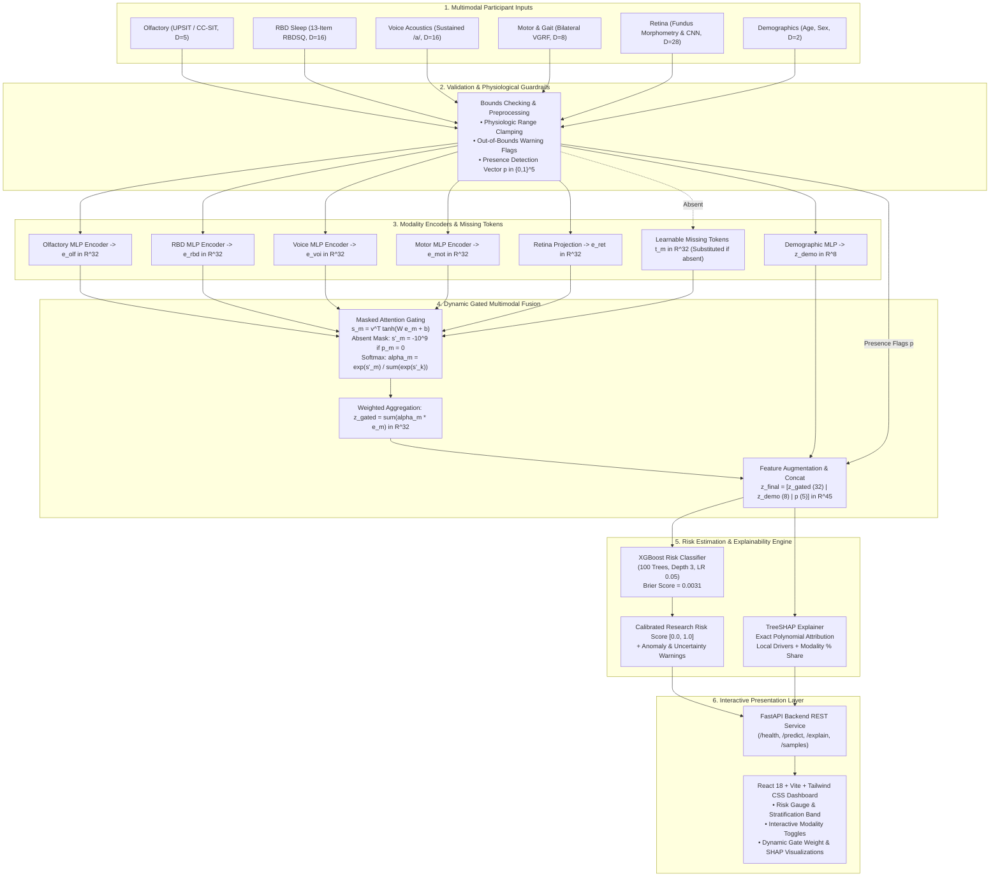

# MPF-PD System Architecture

**Multimodal Prodromal Fusion for Parkinson’s Disease Risk Screening**  
*Investigational Research Prototype — System Architecture Specification*

---

> [!IMPORTANT]
> ### RESEARCH PROTOTYPE NOTICE & CLINICAL DISCLAIMER
> This system is an **investigational research prototype**. It **does not diagnose Parkinson’s disease** and must **never** be used as a standalone diagnostic tool. Its sole purpose is to investigate algorithmic fusion of prodromal biomarkers for research risk stratification. Permissible terminology includes *"research risk estimate"*, *"elevated Parkinson's risk pattern"*, and *"increased risk signal"*. Clinician review is mandatory for any future clinical investigation.

---

## 1. High-Level Architecture Overview

The MPF-PD platform implements an end-to-end multi-branch machine learning architecture designed to aggregate five heterogeneous biomarker streams:
1. **Olfactory Assessment** (UPSIT score, error distribution, response latency)
2. **REM Sleep Behavior Disorder** (RBDSQ item scores, high-weight symptoms, cutoffs)
3. **Voice Acoustics** (sustained vowel `/a/` phonation dysphonia measures: jitter, shimmer, HNR, RPDE, DFA, PPE)
4. **Motor & Gait Dynamics** (vertical ground reaction force time-series: cadence, stride regularity, gait speed, stance/swing ratio)
5. **Retinal Microvasculature** (fundus imaging: vessel density, tortuosity, foveal avascular zone area, fractal branching, and CNN latent embeddings)

These distinct modalities are validated, preprocessed, projected into a shared latent embedding space, and dynamically integrated through a **Gated Multimodal Fusion Attention Network**. A final calibrated classifier produces a bounded research risk score accompanied by exact **TreeSHAP** feature and modality attributions.

---

## 2. Mermaid Architecture Diagram



---

## 3. Repository Structure

```
mini project/
├── README.md                           # Master project documentation & guide
├── PROJECT_ARCHITECTURE.md             # System structure and data flow (this document)
├── DATASETS.md                         # Dataset catalog, licensing, and cohorts
├── MODEL_ARCHITECTURE.md               # Mathematical formulation of encoders & fusion
├── METHODOLOGY.md                      # Experimental design, splitting, leakage prevention
├── EXPERIMENTS.md                      # Detailed protocols for all Phase 1-10 experiments
├── RESULTS.md                          # Verifiable benchmark tables, calibration, SHAP
├── LIMITATIONS.md                      # Scientific, clinical, and data limitations
├── ETHICAL_CONSIDERATIONS.md           # Ethical boundaries, privacy, clinical oversight
├── DEPLOYMENT.md                       # Local execution, API endpoints, productionization
├── config.yaml                         # Global system configuration, paths, seeds, flags
├── requirements.txt                    # Python runtime dependencies
├── dashboard/                          # Full-stack research interactive interface
│   ├── api/                            # FastAPI backend REST service
│   │   ├── main.py                     # API entry point & CORS configuration
│   │   ├── routes.py                   # Endpoints: /health, /predict, /explain, /samples
│   │   └── schemas.py                  # Pydantic request & response validation schemas
│   └── frontend/                       # Modern React + Vite + Tailwind CSS web application
│       ├── src/
│       │   ├── App.jsx                 # Main application dashboard layout
│       │   ├── components/             # UI widgets: RiskGauge, ModalityInputs, XAIWaterfall, etc.
│       │   └── services/api.js         # Axios HTTP client connecting to FastAPI
├── data/                               # Structured dataset storage (strictly gitignored)
│   ├── raw/                            # Immutable source raw data (PPMI, PhysioNet, UCI, etc.)
│   ├── interim/                        # Cleaned tabular extracts & intermediate arrays
│   ├── processed/                      # Model-ready participant-level normalized splits
│   ├── external/                       # Normative demographic lookup tables
│   └── metadata/                       # Dataset catalog, provenance cards, split manifests
├── docs/                               # Comprehensive research documentation suite
│   ├── PROJECT_ARCHITECTURE.md         # System structure and data flow (this document)
│   ├── DATASETS.md                     # Dataset catalog, licensing, and cohorts
│   ├── MODEL_ARCHITECTURE.md           # Mathematical formulation of encoders & fusion
│   ├── METHODOLOGY.md                  # Experimental design, splitting, leakage prevention
│   ├── EXPERIMENTS.md                  # Detailed protocols for all Phase 1-10 experiments
│   ├── RESULTS.md                      # Verifiable benchmark tables, calibration, SHAP
│   ├── LIMITATIONS.md                  # Scientific, clinical, and data limitations
│   ├── ETHICAL_CONSIDERATIONS.md       # Ethical boundaries, privacy, clinical oversight
│   └── DEPLOYMENT.md                   # Local execution, API endpoints, productionization
├── evaluation/                         # Evaluation artifacts, JSON benchmarks, & figures
│   ├── FINAL_EVALUATION.md             # Comprehensive Phase 10 QA & validation report
│   ├── XAI_REPORT.md                   # SHAP explainability audit & feature importance
│   ├── fusion_results.json             # Fusion & baseline performance metrics
│   ├── missing_modality_analysis.json  # Degradation profiles under absent modalities
│   ├── leakage_report.json             # Participant-level disjointness audit
│   ├── dataset_validation.json         # Dataset catalog verification
│   ├── figures/                        # Generated ROC curves, calibration, gate weights
│   │   ├── fusion_roc.png
│   │   ├── fusion_calibration.png
│   │   ├── fusion_confusion_matrix.png
│   │   ├── gate_weights_distribution.png
│   │   ├── missing_modality_impact.png
│   │   └── modality_comparison_roc.png
│   └── *_results.json                  # Single-modality evaluation metrics
├── models/                             # Serialized model checkpoints & encoders
│   ├── olfactory/                      # Random Forest model & metadata
│   ├── rbd/                            # Logistic Regression model & metadata
│   ├── voice/                          # Logistic Regression dysphonia model & metadata
│   ├── motor/                          # VGRF gait Logistic Regression model & metadata
│   ├── retina/                         # Vascular morphometry extractor & CNN metadata
│   └── fusion/                         # GatedMultimodalFusion PyTorch encoder & XGBoost classifier
├── scripts/                            # Operational & validation automation scripts
│   ├── healthcheck.py                  # Environment, artifact, and dependency verification
│   └── run_phase10_validation.py       # Exhaustive validation test runner
├── src/                                # Core library source code
│   ├── config.py                       # Structured configuration loader
│   ├── logging_utils.py                # Audited logging configuration
│   ├── seeds.py                        # Deterministic random seed controller
│   ├── data/                           # Data loading, validation, and registry modules
│   ├── olfactory/                      # Feature extraction & olfactory modeling
│   ├── rbd/                            # RBDSQ scoring & questionnaire modeling
│   ├── voice/                          # Acoustic feature extraction & voice modeling
│   ├── motor/                          # VGRF gait signal processing & motor modeling
│   ├── retina/                         # Fundus vessel segmentation & CNN feature extraction
│   └── fusion/                         # Gated fusion network, training loop, & inference
└── tests/                              # Comprehensive test suite (238+ test assertions)
```

---

## 4. End-to-End Data Flow

```
[Raw Biomarker Inputs] 
         │ (Olfactory, RBD, Voice audio/features, Motor force/features, Retinal image/features)
         ▼
[Input Validation Layer] ──> Verifies data types, physiologic bounds, missingness flags
         │
         ▼
[Feature Extraction & Preprocessing]
  ├── Olfactory: UPSIT scoring, error counts, latency normalization
  ├── RBD: RBDSQ sub-item encoding, cutoff indicators
  ├── Voice: Acoustic feature normalization (Praat/UCI standard)
  ├── Motor: VGRF stride segmentation & gait parameter calculation
  └── Retina: Morphological vessel segmentation & ResNet18 visual encoding
         │
         ▼
[Modality Encoders (PyTorch)] ──> Projects each modality to shared d=32 embedding
  Demographic MLP (Age, Sex) ──> Projects to d=8 demographic embedding
  Presence Flags Vector      ──> Binary indicators [m_olf, m_rbd, m_voi, m_mot, m_ret]
         │
         ▼
[Gated Multimodal Attention Fusion]
  ├── Masking: Applies -1e9 mask to absent modalities
  ├── Softmax Attention: Dynamically redistributes attention weights across present branches
  └── Weighted Aggregation: Concatenates gated embedding (d=32) + demo (d=8) + presence (d=5) = d=45
         │
         ▼
[Final Risk Classifier (XGBoost)] ──> Outputs calibrated risk probability [0.0, 1.0]
         │
         ├──────────────────────────────────────────┐
         ▼                                          ▼
[Research Risk Estimate]                 [Exact TreeSHAP Explanation]
  • Low / Moderate / Elevated signal       • Modality-level attribution (%)
  • Confidence & missingness warnings      • Fused feature attribution
         │                                          │
         └──────────────────┬───────────────────────┘
                            ▼
           [FastAPI Service & React Dashboard]
```

---

## 5. Modality Processing Pipelines

### 5.1 Olfactory Pipeline
- **Inputs:** 40-item University of Pennsylvania Smell Identification Test (UPSIT) or condensed 12-item CC-SIT responses.
- **Features Extracted:** `total_score`, `pct_correct`, `response_time_mean`, `n_errors`, `error_pattern_flags`.
- **Pretrained/Heuristic Model:** Random Forest Classifier trained on normative and hyposmic error patterns.
- **Output:** 5-dimensional feature vector projected to 32-dimensional modality embedding.

### 5.2 REM Sleep Behavior Disorder (RBD) Pipeline
- **Inputs:** 13-item REM Sleep Behavior Disorder Screening Questionnaire (RBDSQ).
- **Features Extracted:** `rbdsq_total`, `above_cutoff_flag` ($\ge 5$), `high_weight_item_flags` (e.g., violent dreams, motor enactments), and individual item indicators `item_1` through `item_13`.
- **Pretrained/Heuristic Model:** Logistic Regression classifier with L2 regularization.
- **Output:** 16-dimensional feature vector projected to 32-dimensional modality embedding.

### 5.3 Voice & Speech Acoustics Pipeline
- **Inputs:** Sustained vowel phonation (`/a/`, 3–5 seconds recording) or pre-extracted acoustic tables.
- **Features Extracted:** 16 dysphonia features including fundamental frequency perturbation (jitter local, absolute, RAP, PPQ5, DDP), amplitude perturbation (shimmer local, dB, APQ3, APQ5, APQ11, DDA), Noise-to-Harmonics Ratio (NHR), Harmonics-to-Noise Ratio (HNR), Recurrence Period Density Entropy (RPDE), Detrended Fluctuation Analysis (DFA), and Pitch Period Entropy (PPE).
- **Pretrained/Heuristic Model:** Logistic Regression classifier.
- **Output:** 16-dimensional feature vector projected to 32-dimensional modality embedding.

### 5.4 Motor & Gait Dynamics Pipeline
- **Inputs:** Bilateral vertical ground reaction force (VGRF) time-series (8 force sensors per foot) or extracted gait dynamics.
- **Features Extracted:** `gait_speed_m_per_s`, `cadence_steps_per_min`, `stride_interval_mean_s`, `stride_interval_cv_pct`, `step_regularity`, `symmetry_index_pct`, `accel_variance`, `stance_swing_ratio`.
- **Pretrained/Heuristic Model:** Logistic Regression classifier.
- **Output:** 8-dimensional feature vector projected to 32-dimensional modality embedding.

### 5.5 Retinal Microvasculature Pipeline
- **Inputs:** Digital color fundus photography (macula- and optic disc-centered) or pre-extracted vascular parameters.
- **Features Extracted:** 12 vascular morphometry metrics: `vessel_density`, `mean_vessel_diameter_px`, `vessel_tortuosity_index`, `branch_count`, `branch_point_density`, `endpoint_count`, `peripapillary_vessel_density`, `peripapillary_branch_count`, `macular_vessel_density`, `foveal_avascular_zone_area_px`, optic disc and macula detection flags + 16-dimensional CNN latent representation (from ResNet18 backbone) = 28 features.
- **Output:** 28-dimensional feature vector projected to 32-dimensional modality embedding.

---

## 6. Gated Multimodal Fusion Architecture

### 6.1 Mathematical Formulation
Let $\mathcal{M} = \{\text{olfactory}, \text{rbd}, \text{voice}, \text{motor}, \text{retina}\}$ be the set of modalities ($M = 5$).  
For each modality $m \in \mathcal{M}$:
1. If modality $m$ is **present** ($p_m = 1$), raw features $x_m \in \mathbb{R}^{D_m}$ are mapped through encoder $f_m$:
   $$e_m = f_m(x_m) \in \mathbb{R}^{d}, \quad d = 32$$
2. If modality $m$ is **absent** ($p_m = 0$), a learnable missing token $t_m \in \mathbb{R}^{d}$ is substituted:
   $$e_m = t_m$$

### 6.2 Dynamic Gated Attention
An attention mechanism computes an unnormalized scalar score $s_m$ for each modality:
$$s_m = \mathbf{w}_{\text{gate}}^\top \tanh(\mathbf{W}_a e_m + \mathbf{b}_a)$$

To strictly prevent absent modalities from influencing the fusion representation, an attention mask is applied:
$$s'_m = \begin{cases} s_m & \text{if } p_m = 1 \\ -\infty & \text{if } p_m = 0 \end{cases}$$

Normalized gate weights are calculated using the softmax function:
$$\alpha_m = \frac{\exp(s'_m)}{\sum_{k \in \mathcal{M}} \exp(s'_k)}$$

If all modalities are absent ($\sum p_k = 0$), uniform weights $\alpha_m = \frac{1}{M}$ are applied to the missing tokens.

The gated multimodal representation $z_{\text{gated}} \in \mathbb{R}^{32}$ is computed as:
$$z_{\text{gated}} = \sum_{m \in \mathcal{M}} \alpha_m e_m$$

### 6.3 Demographic and Presence Augmentation
Demographic variables (age, sex) are projected through a 2-layer MLP to generate $z_{\text{demo}} \in \mathbb{R}^{8}$.  
The final representation $z_{\text{final}} \in \mathbb{R}^{45}$ concatenates:
$$z_{\text{final}} = [z_{\text{gated}} \;\|\; z_{\text{demo}} \;\|\; \mathbf{p}] \in \mathbb{R}^{32 + 8 + 5} = \mathbb{R}^{45}$$

---

## 7. Explanation Layer (SHAP)

The final risk classifier is an **XGBoost** model (`XGBClassifier`) fitted on the 45-dimensional representation $z_{\text{final}}$.

- **Exact TreeExplainer:** Because XGBoost consists of decision trees, the SHAP `TreeExplainer` calculates exact Shapley values without sampling approximations.
- **Attribution Breakdown:**
  1. **Fused representation dimensions** ($z_0 \dots z_{31}$): Quantify the impact of the fused multimodal state.
  2. **Demographic dimensions** ($z_{32} \dots z_{39}$): Quantify covariate influence (age, sex).
  3. **Presence flags** ($p_{40} \dots p_{44}$): Explicitly measure the statistical impact of omitting or providing a modality.
- **Modality-Level Redistribution:** Modality contribution percentages are computed by weighting the gated representation Shapley values by the dynamic gate weights $\alpha_m$ combined with the presence flag Shapley values.

---

## 8. Dashboard Architecture

The MPF-PD interactive dashboard provides a responsive, privacy-preserving research interface:
- **Backend (FastAPI):**
  - High-performance asynchronous REST API running on Uvicorn.
  - Endpoints for single-participant prediction (`POST /predict`), explainability generation (`POST /explain`), synthetic sample loading (`GET /samples`), and health checking (`GET /health`).
  - Strict Pydantic validation prevents malformed requests and unhandled exceptions.
- **Frontend (React + Tailwind CSS):**
  - Component-driven architecture using Vite.
  - Interactive risk gauge displaying continuous risk score $[0, 1]$ and uncertainty band.
  - Modality toggles allowing researchers to dynamically simulate missing modalities and observe gate reallocations in real-time.
  - Interactive SHAP waterfall and horizontal bar plots detailing positive and negative risk contributors.

---

## 9. Artifact Storage & Registry

All trained weights, scalers, and evaluation outputs are persisted deterministically:

| Artifact Type | File Path | Format | Purpose |
| :--- | :--- | :--- | :--- |
| Fusion Classifier | `models/fusion/classifier.joblib` | Joblib / XGBoost | Final risk classification model |
| Fusion Encoder | `models/fusion/fusion_encoder.pt` | PyTorch State Dict | Modality encoders & attention gating |
| Fusion Preprocessor | `models/fusion/preprocessor.joblib` | Joblib / Scikit-Learn | Imputers and scalers fitted on train split |
| Fusion Metadata | `models/fusion/metadata.json` | JSON | Architecture parameters, gate weights, training info |
| Single-Modality Checkpoints | `models/{modality}/model.joblib` | Joblib | Modality-specific baseline models |
| Evaluation Benchmarks | `evaluation/fusion_results.json` | JSON | Exact performance metrics & bootstrap CIs |
| Missingness Profile | `evaluation/missing_modality_analysis.json` | JSON | Gate weights & AUC across 10 missingness subsets |
| Audit Reports | `evaluation/leakage_report.json` | JSON | Verification of zero participant-level leakage |
