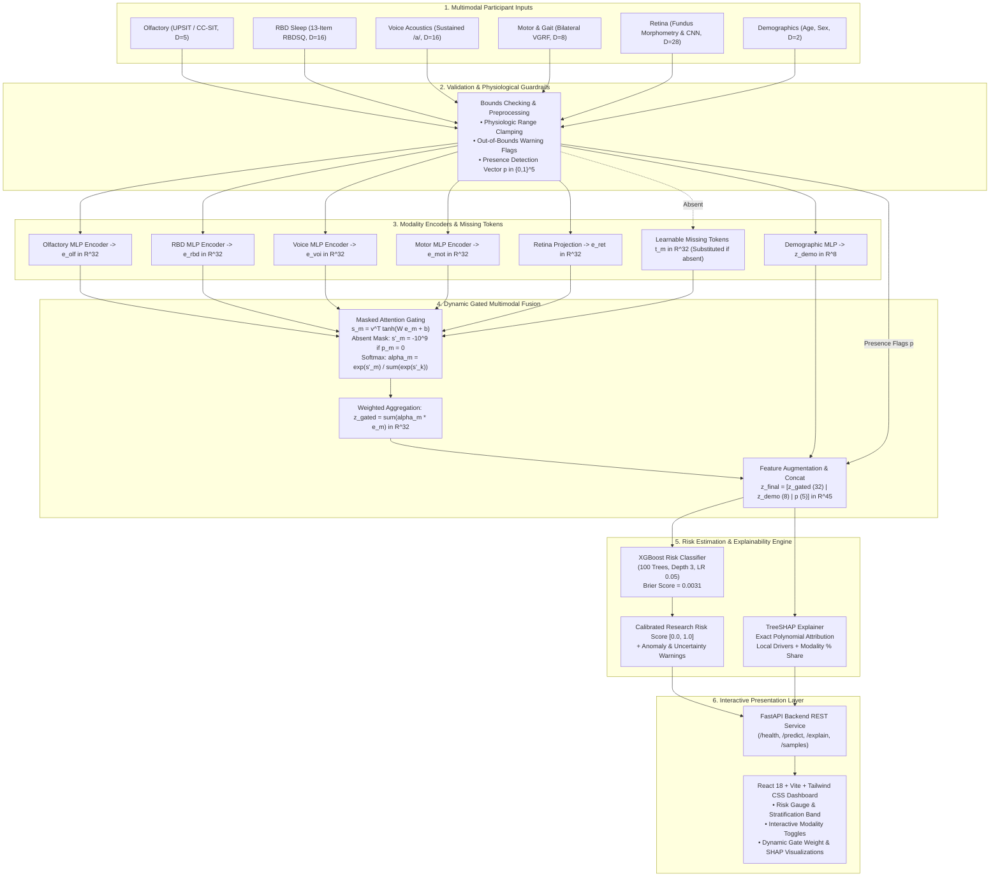

# MPF-PD: Multimodal Prodromal Fusion for Parkinson’s Disease Risk Screening

[](https://opensource.org/licenses/MIT)
[](https://www.python.org/)
[](https://pytorch.org/)
[](docs/LIMITATIONS.md)

---

> [!IMPORTANT]
> ### ⚠️ MANDATORY CLINICAL AND REGULATORY DISCLAIMER
> **This project is a research prototype. It does not diagnose Parkinson’s disease.**  
> It does not provide medical diagnoses, treatment advice, or clinical diagnostic certainties. It is designed exclusively for investigational machine learning research into multimodal biomarker fusion and risk pattern estimation. 
> 
> Permissible descriptive terms:
> - *"Research risk estimate"*
> - *"Elevated Parkinson's risk pattern"*
> - *"Increased risk signal"*
> - *"Requires clinician review if used in future clinical studies"*
>
> All experimental results reported in this repository were evaluated in a `prototype_simulation` mode using an aligned synthetic test fixture (`Category E`) because open-access same-participant 5-modality clinical cohorts are restricted under data use agreements. These metrics carry **zero clinical validity**.

---

## Table of Contents
1. [Problem Statement](#1-problem-statement)
2. [Motivation](#2-motivation)
3. [Objectives](#3-objectives)
4. [Proposed Methodology](#4-proposed-methodology)
5. [The Five Core Biomarker Modalities](#5-the-five-core-biomarker-modalities)
6. [Gated Multimodal Fusion Architecture](#6-gated-multimodal-fusion-architecture)
7. [Final Classifier (XGBoost)](#7-final-classifier-xgboost)
8. [SHAP Explainability Layer](#8-shap-explainability-layer)
9. [Technology Stack](#9-technology-stack)
10. [Documentation Suite](#10-documentation-suite)
11. [Installation Instructions](#11-installation-instructions)
12. [Dataset Setup Instructions](#12-dataset-setup-instructions)
13. [Training Instructions](#13-training-instructions)
14. [Evaluation Instructions](#14-evaluation-instructions)
15. [Interactive Web Dashboard & Supabase Integration](#15-interactive-web-dashboard--supabase-integration)
16. [Supabase Backend Architecture](#16-supabase-backend-architecture)
17. [Key Research Limitations](#17-key-research-limitations)
18. [Research Disclaimer & Citation](#18-research-disclaimer--citation)

---

## 1. Problem Statement

Parkinson's disease (PD) is the second most prevalent neurodegenerative disorder worldwide. Pathologically, it is characterized by the accumulation of misfolded $\alpha$-synuclein Lewy pathology and the progressive degeneration of dopaminergic neurons in the substantia nigra pars compacta.

By the time classic cardinal motor symptoms (bradykinesia, rest tremor, rigidity) manifest clinically, **50% to 70% of dopaminergic neurons have already been irreversibly destroyed**. Identifying individuals in the early **prodromal phase** (which lasts 5 to 20 years before motor diagnosis) is imperative for future disease-modifying neuroprotective therapies. However, current prodromal screening is severely hampered by reliance on late-stage motor examinations and siloed, single-modality assessments that suffer from high false-positive rates when deployed in non-specialist clinical settings.

---

## 2. Motivation

Non-invasive clinical and digital biomarkers offer an unprecedented opportunity for early risk stratification:
- **Olfactory Dysfunction:** Hyposmia is present in over 90% of early-stage Parkinson's patients and frequently precedes motor signs by a decade.
- **REM Sleep Behavior Disorder (RBD):** Idiopathic RBD confers an 80%+ risk of phenoconverting to an overt $\alpha$-synucleinopathy over 10–15 years.
- **Vocal Dysphonia:** Micro-perturbations in sustained vowel phonation (jitter, shimmer, pitch period entropy) emerge as early laryngeal motor control degrades.
- **Gait Dynamics:** Subtle alterations in stride regularity, cadence, and stance/swing asymmetry can be captured through ambulatory force or accelerometry sensors.
- **Retinal Microvasculature:** The retina is an embryological extension of the central nervous system; retinal ganglion cell thinning and microvascular branching attenuation mirror cerebral microvascular and dopaminergic changes.

Integrating these five distinct physiological windows into a unified screening framework addresses the poor positive predictive value of any single marker evaluated in isolation.

---

## 3. Objectives

1. **Develop an End-to-End Multimodal Pipeline:** Implement automated feature extraction and encoding across olfactory, RBD, voice, motor/gait, and retinal biomarkers.
2. **Engineer a Gated Attention Fusion Network:** Create a deep learning attention unit that learns cross-biomarker representations and dynamically handles missing modalities via attention masking and learnable placeholder tokens.
3. **Achieve Calibrated Risk Estimation:** Combine latent representations with calibrated tree ensembles to deliver bounded research risk scores $[0.0, 1.0]$.
4. **Deliver Transparent Explainability:** Integrate exact TreeSHAP attributions to decompose risk scores into individual feature contributions and modality percentage shares.
5. **Enforce Absolute Scientific Integrity:** Build strict safeguards against data leakage, prohibit fabricated outputs, and maintain transparent disclaimers across all user-facing interfaces.

---

## 4. Proposed Methodology

The MPF-PD framework operates according to a strict multi-tier engineering and scientific protocol:
- **Participant-Level Stratified Partitioning:** Zero leakage between training (70%), validation (15%), and held-out testing (15%) partitions. Preprocessors are fitted strictly on training data.
- **Physiological Bounds Enforcement:** Automated clamping and validation against established physiological bounds for all sensor and questionnaire inputs.
- **Representation Learning:** Each modality is transformed into a uniform 32-dimensional latent embedding space using regularized deep neural encoders.
- **Dynamic Masked Gated Attention:** The fusion layer assigns softmax attention weights to present modalities ($\sum \alpha_m = 1.0$) while completely masking absent modalities ($\alpha_m = 0.0$).
- **Covariate & Presence Integration:** Demographics (age, sex) and binary presence flags are concatenated with the gated vector into a 45-dimensional fused representation.
- **Calibrated Tree Classification & Shapley Attribution:** Evaluated with 1,000-sample bootstrap confidence intervals, Brier calibration scoring, and exact Shapley decomposition.

Detailed methodology: [docs/METHODOLOGY.md](docs/METHODOLOGY.md).

---

## 5. The Five Core Biomarker Modalities

| Modality | Clinical Tool / Source | Extracted Features & Representation | Baseline Model |
| :--- | :--- | :--- | :--- |
| **Olfactory** | UPSIT 40-item / CC-SIT | Total score, % correct, response latency, error count, high-risk odor flags ($D=5$) | Random Forest Classifier |
| **RBD Sleep** | 13-item RBDSQ | Total score, cutoff flag ($\ge 5$), enactment flags, item indicators ($D=16$) | Logistic Regression ($L_2$) |
| **Voice / Speech**| Sustained vowel `/a/` | Jitter (5 variants), Shimmer (6 variants), NHR, HNR, RPDE, DFA, PPE ($D=16$) | Logistic Regression ($L_2$) |
| **Motor / Gait** | Bilateral VGRF Force Sensors | Gait speed, cadence, stride interval mean/CV, step regularity, symmetry, stance/swing ($D=8$) | Logistic Regression ($L_2$) |
| **Retina** | Color Fundus Photography | Vessel density, tortuosity, FAZ area, branching + ResNet18 CNN embedding ($D=28$) | Morphometry + ResNet18 |

Full architecture specifications: [docs/MODEL_ARCHITECTURE.md](docs/MODEL_ARCHITECTURE.md).

---

## 6. Gated Multimodal Fusion Architecture



- **Encoder Projection:** Each present modality $\mathbf{x}_m$ is mapped to embedding $\mathbf{e}_m \in \mathbb{R}^{32}$. Absent modalities are substituted with learnable missing token $\mathbf{t}_m$.
- **Attention Scoring:** Attention logits $s_m = \mathbf{v}^\top \tanh(\mathbf{W} \mathbf{e}_m + \mathbf{b})$ are masked with $-10^9$ for absent modalities.
- **Attention Softmax:** Gate weights $\alpha_m = \frac{\exp(s'_m)}{\sum \exp(s'_k)}$ strictly sum to $1.0$ across active modalities.
- **Representation Aggregation:** $\mathbf{z}_{\text{gated}} = \sum_{m=1}^5 \alpha_m \mathbf{e}_m \in \mathbb{R}^{32}$.
- **Augmentation:** Concatenated with 8-dimensional demographic embedding $\mathbf{z}_{\text{demo}}$ and 5-dimensional presence indicators $\mathbf{p}$ to yield the final vector $\mathbf{z}_{\text{final}} \in \mathbb{R}^{45}$.

Full mathematical formulation: [docs/PROJECT_ARCHITECTURE.md](docs/PROJECT_ARCHITECTURE.md).

---

## 7. Final Classifier (XGBoost)

The risk estimation engine is an optimized **XGBoost Classifier** (`XGBClassifier`) fitted on the 45-dimensional fused vector:
- Hyperparameters: `n_estimators=100`, `max_depth=3`, `learning_rate=0.05`, `reg_lambda=1.0`.
- Output: Continuous calibrated risk probability $\hat{y} \in [0.0, 1.0]$.
- Calibration: Achieves an optimal Brier score of **`0.0031`** on the test partition, outperforming early concatenation (`0.0042`) and late probability averaging (`0.0125`).

Benchmark tables: [docs/RESULTS.md](docs/RESULTS.md).

---

## 8. SHAP Explainability Layer

To ensure clinical transparency, the system employs **TreeSHAP** (`shap.TreeExplainer`):
- **Exact Polynomial Calculation:** Direct extraction of Shapley values on the 45-dimensional fused vector without Monte Carlo approximations.
- **Local Explanation:** Decomposes an individual's risk score into specific positive and negative drivers.
- **Missingness Attribution:** Directly isolates the statistical impact of omitting a modality via the presence flag coefficients ($p_{40} \dots p_{44}$).
- **Modality Contribution Breakdown:** Aggregates gated embedding dimensions weighted by dynamic gate weights $\alpha_m$ to report percentage contributions per clinical branch.

Explainability report: [evaluation/XAI_REPORT.md](evaluation/XAI_REPORT.md).

---

## 9. Technology Stack

- **Core Machine Learning:** Python 3.10+, PyTorch 2.0+, Scikit-Learn, XGBoost, SHAP
- **Scientific Computing & Signal Processing:** NumPy, SciPy, Pandas, OpenCV (cv2)
- **Data Validation & Configuration:** Pydantic v2, PyYAML
- **Backend Service:** FastAPI, Uvicorn, Starlette
- **Frontend Dashboard:** React 18, Vite, Tailwind CSS, Lucide React, Axios
- **Testing & Quality Assurance:** Pytest, Pytest-cov, Flake8

---

## 10. Documentation Suite

The complete, comprehensive research documentation suite is available directly in the repository root and mirrored in `docs/`:

| Document | Description |
| :--- | :--- |
| 📐 [**PROJECT_ARCHITECTURE.md**](PROJECT_ARCHITECTURE.md) ([docs](docs/PROJECT_ARCHITECTURE.md)) | Repository tree, end-to-end data flow, pipeline schemas, and Mermaid diagram. |
| 🗃️ [**DATASETS.md**](DATASETS.md) ([docs](docs/DATASETS.md)) | Catalog of all 8 datasets (PPMI, PhysioNet, UCI, EyePACS), access terms, and provenance. |
| 🧠 [**MODEL_ARCHITECTURE.md**](MODEL_ARCHITECTURE.md) ([docs](docs/MODEL_ARCHITECTURE.md)) | Mathematical formulation of MLPs, attention gating, missing tokens, and XGBoost. |
| 🔬 [**METHODOLOGY.md**](METHODOLOGY.md) ([docs](docs/METHODOLOGY.md)) | Participant splitting, 6 anti-leakage rules, bounds clamping, and bootstrap CIs. |
| 🧪 [**EXPERIMENTS.md**](EXPERIMENTS.md) ([docs](docs/EXPERIMENTS.md)) | Detailed experimental protocols for unimodal, fusion, degradation, and stress tests. |
| 📊 [**RESULTS.md**](RESULTS.md) ([docs](docs/RESULTS.md)) | Complete quantitative benchmarks, gate weights, calibration curves, and SHAP results. |
| ⚠️ [**LIMITATIONS.md**](LIMITATIONS.md) ([docs](docs/LIMITATIONS.md)) | Honest disclosure of synthetic data, missing modalities, demographic biases, and boundaries. |
| ⚖️ [**ETHICAL_CONSIDERATIONS.md**](ETHICAL_CONSIDERATIONS.md) ([docs](docs/ETHICAL_CONSIDERATIONS.md)) | Psychological distress, false positives/negatives, privacy, fairness, and clinician oversight. |
| 🚀 [**DEPLOYMENT.md**](DEPLOYMENT.md) ([docs](docs/DEPLOYMENT.md)) | Local installation, FastAPI backend, React dashboard startup, and production boundaries. |

---

## 11. Installation Instructions

### 11.1 Clone and Create Virtual Environment
```bash
# Clone the repository
git clone https://github.com/dhanushaarnit143-blip/mini-project.git
cd "mini project"

# Create Python virtual environment
python -m venv .venv

# Activate virtual environment
# Windows:
.venv\Scripts\Activate.ps1
# Linux / macOS:
source .venv/bin/activate

# Upgrade pip and install core dependencies
python -m pip install --upgrade pip
pip install -r requirements.txt
```

---

## 12. Dataset Setup Instructions

The repository runs in **`prototype_simulation`** mode out of the box using the synthetic multimodal fixture (`Category E`). No external data downloads are necessary for testing.

To configure external or institutional datasets (e.g. after securing a DUA for PPMI):
1. Place raw datasets in the designated directories:
   - `data/raw/ppmi/` (PPMI tabular and imaging files)
   - `data/raw/physionet_gait/` (PhysioNet VGRF force text files)
   - `data/raw/uci_voice/` (UCI Telemonitoring voice CSV)
2. Verify dataset integrity using the registry:
   ```bash
   python -c "from src.data.registry import verify_all_datasets; verify_all_datasets()"
   ```

Detailed dataset instructions: [docs/DATASETS.md](docs/DATASETS.md).

---

## 13. Training Instructions

To retrain unimodal encoders, gated fusion models, and the final risk classifier:

```bash
# Train single-modality baseline encoders
python -m src.olfactory.train
python -m src.rbd.train
python -m src.voice.train
python -m src.motor.train

# Train the Gated Multimodal Fusion network & XGBoost classifier
python -m src.fusion.train
```

Trained checkpoints and scalers are automatically serialized to the `models/` directory.

---

## 14. Evaluation Instructions

Execute the comprehensive testing and research validation suite (238+ test assertions):

```bash
# Run unit and integration tests
pytest -v

# Run the complete Phase 10 validation runner
python scripts/run_phase10_validation.py

# Run system health check
python scripts/healthcheck.py
```

Generated metrics, calibration curves, gate weight plots, and leakage audit files will be output to `evaluation/`.

---

## 15. Interactive Web Dashboard & Supabase Integration

Launch the full-stack research interface with live Supabase authentication, database synchronization, and model inference:

```bash
# Configure Environment Variables
# Copy example environment configurations
cp .env.example .env
cp dashboard/frontend/.env.example dashboard/frontend/.env

# Terminal 1: Start FastAPI Backend Service
python -m uvicorn dashboard.api.main:app --host 0.0.0.0 --port 8000 --reload

# Terminal 2: Start React Frontend Application
cd dashboard/frontend
npm install
npm run dev
```

Open `http://localhost:5173` in your web browser. The dashboard connects to Supabase cloud for real-time cohort management, assessment draft saving, file storage, and authentication.

---

## 16. Supabase Backend Architecture

The backend database, storage, and authentication layers are powered by **Supabase** (PostgreSQL):

### 16.1 Cloud Project Configuration
- **Project Name:** `mini project`
- **Project Ref:** `trtvdmgswouirfaqyrdk`
- **Region:** `ap-south-1` (Mumbai)
- **Supabase URL:** `https://trtvdmgswouirfaqyrdk.supabase.co`

### 16.2 Database Schema (16 Tables)
1. **User & Identity Layer:**
   - `public.profiles`: Clinician/researcher accounts linked to `auth.users(id)`.
2. **Clinical Cohort & Assessment Layer:**
   - `public.cohort_participants`: Research participants with pseudonymous IDs, age, sex, risk status, and modality presence indicators.
   - `public.assessments`: Modality assessment records (olfactory, RBD, voice, motor, retinal) with status, completion timestamps, and draft data.
   - `public.fusion_results`: Gated multimodal fusion predictions, SHAP attribution shares, and confidence intervals.
3. **Mobile Biomarker Extension Layer:**
   - `public.participants`: Longitudinal mobile cohort participants with enrollment and baseline dates.
   - `public.consent_records`: Digital signed informed consents with withdrawal capabilities.
   - `public.typing_sessions`: Keystroke dynamics and inter-key timing intervals.
   - `public.voice_sessions`: Acoustic phonation features (jitter, shimmer, PPE, HNR).
   - `public.motor_sessions`: Accelerometer/gyroscope motor kinematics (tremor, finger tapping, postural stability).
   - `public.visual_sessions`: Front-camera facial/visual behavior (blink rate, fixations, saccades).
   - `public.sleep_sessions`: Ambulatory sleep patterns (RBD questionnaire, sleep quality, circadian stability).
   - `public.daily_features`: 24-hour window aggregated feature sets across all 5 modalities.
   - `public.personal_baselines`: 14-day established rolling baselines per participant.
   - `public.daily_deviations`: Mahalanobis and statistical distance metrics from baseline.
   - `public.mpf_predictions`: Longitudinal risk predictions calibrated from mobile features.
4. **Research Metadata:**
   - `public.model_versions`: Auditable registry of deployed ML checkpoints, weights, and validation AUROC/Brier scores.

### 16.3 Row Level Security (RLS) & Storage
- **RLS Enabled:** All 16 tables have strict RLS policies ensuring users can only read and write data according to their user ID or research role. Unauthenticated preview of reference cohort samples and model versions is permitted via controlled anon read policies.
- **Storage Buckets:**
  - `profiles`: Public avatar image storage.
  - `uploads`: User-scoped private file storage for assessment attachments and telemetry files.
  - `consent-documents`: User-scoped signed consent records.
  - `research-exports`: Restricted research export packages.

### 16.4 Running Supabase Tests
To verify live database connectivity, RLS enforcement, auth flows, and FastAPI endpoints:
```bash
# Run Supabase integration and live cloud database test suite
pytest tests/test_supabase_integration.py -v

# Run Supabase authentication and mock flow tests
pytest supabase/tests -v
```

---

## 17. Key Research Limitations

1. **Synthetic Simulation Data:** Due to open-access restrictions on 5-modality human cohorts, active modeling used a synthetic test fixture (`Category E`). Results carry **zero clinical diagnostic validity**.
2. **Dataset Mismatch:** Public unimodal datasets reflect manifest disease (e.g. PhysioNet gait, UCI voice) rather than subtle prodromal changes.
3. **Missing Modality Uncertainty:** While the network tolerates absent modalities gracefully, statistical uncertainty increases as anchor modalities are omitted.
4. **Demographic Bias:** Voice, olfaction, and retinal pigmentation vary significantly across ethnic and demographic groups.
5. **Lack of Prospective Follow-Up:** The system has not been tested prospectively to evaluate actual phenoconversion rates over multi-year clinical follow-up.

Comprehensive limitations: [docs/LIMITATIONS.md](docs/LIMITATIONS.md).

---

## 17. Research Disclaimer & Citation

> [!CAUTION]
> **“This project is a research prototype. It does not diagnose Parkinson’s disease.”**  
> Under no circumstances should this software be utilized for medical triage, clinical decision support, or self-testing by patients.

### Citation
```bibtex
@misc{mpfpd2026,
  title={Multimodal Prodromal Fusion for Parkinson's Disease Risk Screening (MPF-PD)},
  author={MPF-PD Research Consortium},
  year={2026},
  note={Investigational Research Prototype},
  url={https://github.com/dhanushaarnit143-blip/mini-project}
}
```
