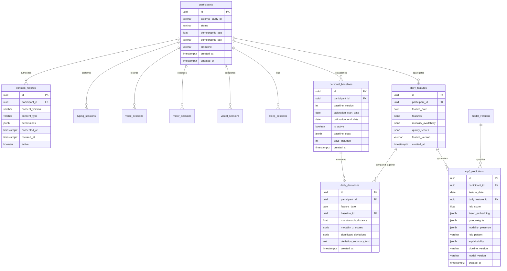

# MPF Mobile Extension — Supabase & Database Architecture Specification

**Multimodal Prodromal Fusion for Parkinson's Disease (MPF-PD)**  
*Relational Data Model, Row-Level Security, Indexes, and Migration Strategy*  
*Document Version: 1.0.0 | Status: APPROVED DATABASE DESIGN*

---

> [!IMPORTANT]
> ### DATABASE INTEGRITY & RESEARCH PRIVACY MANDATE
> - **PSEUDONYMOUS KEYS:** `participant_id` values are cryptographically generated UUIDv4 keys. No Personally Identifiable Information (PII) such as real names, phone numbers, or email addresses is ever stored in feature tables.
> - **ROW LEVEL SECURITY (RLS):** RLS is enabled across **all tables**. Participants can query and write exclusively to their own rows (`auth.uid() = participant_id`). Zero cross-participant data visibility is permitted.
> - **REPRODUCIBILITY & AUDIT TRAILS:** All feature vectors, baselines, and model predictions record explicit version strings (`feature_version`, `baseline_version`, `model_version`).

---

## 1. Relational Database Schema Overview



---

## 2. Complete PostgreSQL Schema DDL

The following standard SQL defines the complete database architecture for execution in Supabase / PostgreSQL 15+:

```sql
-- ============================================================================
-- MPF MOBILE EXTENSION: SUPABASE DATABASE INITIALIZATION DDL
-- Schema Version: 1.0.0
-- ============================================================================

-- Enable required extensions
CREATE EXTENSION IF NOT EXISTS "uuid-ossp";
CREATE EXTENSION IF NOT EXISTS "pgcrypto";

-- ----------------------------------------------------------------------------
-- 1. PARTICIPANTS TABLE
-- ----------------------------------------------------------------------------
CREATE TABLE participants (
    id UUID PRIMARY KEY DEFAULT gen_random_uuid(),
    external_study_id VARCHAR(64) UNIQUE NOT NULL,
    status VARCHAR(32) NOT NULL DEFAULT 'enrolled' 
        CHECK (status IN ('enrolled', 'calibrating', 'active', 'withdrawn', 'completed')),
    demographic_age NUMERIC(5, 2) NOT NULL CHECK (demographic_age BETWEEN 18.0 AND 120.0),
    demographic_sex VARCHAR(16) NOT NULL CHECK (demographic_sex IN ('male', 'female', 'other')),
    timezone VARCHAR(64) NOT NULL DEFAULT 'UTC',
    app_version VARCHAR(32) NOT NULL DEFAULT '1.0.0',
    device_info JSONB NOT NULL DEFAULT '{}'::jsonb,
    created_at TIMESTAMPTZ NOT NULL DEFAULT NOW(),
    updated_at TIMESTAMPTZ NOT NULL DEFAULT NOW()
);

COMMENT ON TABLE participants IS 'Pseudonymized participant registry. Zero PII stored.';

-- ----------------------------------------------------------------------------
-- 2. CONSENT RECORDS TABLE
-- ----------------------------------------------------------------------------
CREATE TABLE consent_records (
    id UUID PRIMARY KEY DEFAULT gen_random_uuid(),
    participant_id UUID NOT NULL REFERENCES participants(id) ON DELETE CASCADE,
    consent_version VARCHAR(32) NOT NULL,
    consent_type VARCHAR(64) NOT NULL 
        CHECK (consent_type IN ('full_study', 'passive_typing', 'active_voice', 'active_motor', 'visual_behavior', 'sleep_survey')),
    permissions JSONB NOT NULL DEFAULT '{"data_collection": true, "research_analysis": true}'::jsonb,
    consented_at TIMESTAMPTZ NOT NULL DEFAULT NOW(),
    revoked_at TIMESTAMPTZ,
    ip_hash VARCHAR(64),
    user_agent TEXT,
    active BOOLEAN NOT NULL DEFAULT TRUE,
    created_at TIMESTAMPTZ NOT NULL DEFAULT NOW()
);

-- ----------------------------------------------------------------------------
-- 3. TYPING SESSIONS TABLE
-- ----------------------------------------------------------------------------
CREATE TABLE typing_sessions (
    id UUID PRIMARY KEY DEFAULT gen_random_uuid(),
    participant_id UUID NOT NULL REFERENCES participants(id) ON DELETE CASCADE,
    session_start TIMESTAMPTZ NOT NULL,
    session_end TIMESTAMPTZ NOT NULL,
    total_keystrokes INT NOT NULL CHECK (total_keystrokes >= 0),
    features JSONB NOT NULL,
    quality_metrics JSONB NOT NULL DEFAULT '{}'::jsonb,
    feature_version VARCHAR(32) NOT NULL DEFAULT '1.0.0',
    created_at TIMESTAMPTZ NOT NULL DEFAULT NOW()
);

COMMENT ON COLUMN typing_sessions.features IS 'Timing dynamics ONLY (hold/flight latencies). Keystroke text is NEVER stored.';

-- ----------------------------------------------------------------------------
-- 4. VOICE SESSIONS TABLE
-- ----------------------------------------------------------------------------
CREATE TABLE voice_sessions (
    id UUID PRIMARY KEY DEFAULT gen_random_uuid(),
    participant_id UUID NOT NULL REFERENCES participants(id) ON DELETE CASCADE,
    task_type VARCHAR(64) NOT NULL CHECK (task_type IN ('sustained_phonation_a', 'standard_reading', 'free_speech')),
    duration_seconds NUMERIC(6, 2) NOT NULL CHECK (duration_seconds > 0.0),
    sample_rate INT NOT NULL CHECK (sample_rate IN (44100, 48000)),
    snr_db NUMERIC(5, 2) NOT NULL,
    features JSONB NOT NULL,
    quality_metrics JSONB NOT NULL DEFAULT '{}'::jsonb,
    feature_version VARCHAR(32) NOT NULL DEFAULT '1.0.0',
    created_at TIMESTAMPTZ NOT NULL DEFAULT NOW()
);

-- ----------------------------------------------------------------------------
-- 5. MOTOR SESSIONS TABLE
-- ----------------------------------------------------------------------------
CREATE TABLE motor_sessions (
    id UUID PRIMARY KEY DEFAULT gen_random_uuid(),
    participant_id UUID NOT NULL REFERENCES participants(id) ON DELETE CASCADE,
    task_type VARCHAR(64) NOT NULL CHECK (task_type IN ('gait_walk_20s', 'finger_tapping_alternation', 'postural_tremor_10s')),
    duration_seconds NUMERIC(6, 2) NOT NULL CHECK (duration_seconds > 0.0),
    sensor_sampling_rate_hz NUMERIC(6, 2) NOT NULL,
    features JSONB NOT NULL,
    quality_metrics JSONB NOT NULL DEFAULT '{}'::jsonb,
    feature_version VARCHAR(32) NOT NULL DEFAULT '1.0.0',
    created_at TIMESTAMPTZ NOT NULL DEFAULT NOW()
);

-- ----------------------------------------------------------------------------
-- 6. VISUAL SESSIONS (OCULAR / VISUAL BEHAVIOR MODULE)
-- ----------------------------------------------------------------------------
CREATE TABLE visual_sessions (
    id UUID PRIMARY KEY DEFAULT gen_random_uuid(),
    participant_id UUID NOT NULL REFERENCES participants(id) ON DELETE CASCADE,
    task_type VARCHAR(64) NOT NULL CHECK (task_type IN ('fixation_stability_3s', 'prosaccade_target_jump', 'smooth_pursuit_horizontal')),
    face_detected_pct NUMERIC(5, 2) NOT NULL CHECK (face_detected_pct BETWEEN 0.0 AND 100.0),
    features JSONB NOT NULL,
    quality_metrics JSONB NOT NULL DEFAULT '{}'::jsonb,
    feature_version VARCHAR(32) NOT NULL DEFAULT '1.0.0',
    created_at TIMESTAMPTZ NOT NULL DEFAULT NOW()
);

COMMENT ON TABLE visual_sessions IS 'Ocular/Visual Behavior Module. NOT retinal imaging. Zero raw video frames stored.';

-- ----------------------------------------------------------------------------
-- 7. SLEEP SESSIONS TABLE
-- ----------------------------------------------------------------------------
CREATE TABLE sleep_sessions (
    id UUID PRIMARY KEY DEFAULT gen_random_uuid(),
    participant_id UUID NOT NULL REFERENCES participants(id) ON DELETE CASCADE,
    session_date DATE NOT NULL,
    rbdsq_total NUMERIC(4, 1) CHECK (rbdsq_total BETWEEN 0.0 AND 13.0),
    rbdsq_items JSONB,
    sleep_duration_hours NUMERIC(4, 2) CHECK (sleep_duration_hours BETWEEN 0.0 AND 24.0),
    nocturnal_awakenings INT CHECK (nocturnal_awakenings >= 0),
    quality_metrics JSONB NOT NULL DEFAULT '{}'::jsonb,
    feature_version VARCHAR(32) NOT NULL DEFAULT '1.0.0',
    created_at TIMESTAMPTZ NOT NULL DEFAULT NOW(),
    CONSTRAINT uq_participant_sleep_date UNIQUE (participant_id, session_date)
);

-- ----------------------------------------------------------------------------
-- 8. DAILY FEATURES TABLE (STANDARDIZED PACKAGING)
-- ----------------------------------------------------------------------------
CREATE TABLE daily_features (
    id UUID PRIMARY KEY DEFAULT gen_random_uuid(),
    participant_id UUID NOT NULL REFERENCES participants(id) ON DELETE CASCADE,
    feature_date DATE NOT NULL,
    features JSONB NOT NULL,
    modality_availability JSONB NOT NULL,
    quality_scores JSONB NOT NULL,
    feature_version VARCHAR(32) NOT NULL DEFAULT '1.0.0',
    created_at TIMESTAMPTZ NOT NULL DEFAULT NOW(),
    CONSTRAINT uq_participant_feature_date UNIQUE (participant_id, feature_date)
);

-- ----------------------------------------------------------------------------
-- 9. PERSONAL BASELINES TABLE (14-DAY CALIBRATION + ROLLING)
-- ----------------------------------------------------------------------------
CREATE TABLE personal_baselines (
    id UUID PRIMARY KEY DEFAULT gen_random_uuid(),
    participant_id UUID NOT NULL REFERENCES participants(id) ON DELETE CASCADE,
    baseline_version INT NOT NULL DEFAULT 1,
    calibration_start_date DATE NOT NULL,
    calibration_end_date DATE NOT NULL,
    is_active BOOLEAN NOT NULL DEFAULT TRUE,
    baseline_stats JSONB NOT NULL,
    days_included INT NOT NULL CHECK (days_included >= 7),
    created_at TIMESTAMPTZ NOT NULL DEFAULT NOW()
);

-- ----------------------------------------------------------------------------
-- 10. DAILY DEVIATIONS TABLE (LONGITUDINAL MONITORING)
-- ----------------------------------------------------------------------------
CREATE TABLE daily_deviations (
    id UUID PRIMARY KEY DEFAULT gen_random_uuid(),
    participant_id UUID NOT NULL REFERENCES participants(id) ON DELETE CASCADE,
    feature_date DATE NOT NULL,
    baseline_id UUID NOT NULL REFERENCES personal_baselines(id) ON DELETE RESTRICT,
    mahalanobis_distance NUMERIC(8, 4),
    modality_z_scores JSONB NOT NULL,
    significant_deviations JSONB NOT NULL DEFAULT '[]'::jsonb,
    deviation_summary_text TEXT NOT NULL,
    created_at TIMESTAMPTZ NOT NULL DEFAULT NOW(),
    CONSTRAINT uq_participant_deviation_date UNIQUE (participant_id, feature_date)
);

-- ----------------------------------------------------------------------------
-- 11. MPF PREDICTIONS TABLE (ADAPTER INFERENCE AUDIT LOG)
-- ----------------------------------------------------------------------------
CREATE TABLE mpf_predictions (
    id UUID PRIMARY KEY DEFAULT gen_random_uuid(),
    participant_id UUID NOT NULL REFERENCES participants(id) ON DELETE CASCADE,
    feature_date DATE NOT NULL,
    daily_feature_id UUID NOT NULL REFERENCES daily_features(id) ON DELETE CASCADE,
    risk_score NUMERIC(5, 4) NOT NULL CHECK (risk_score BETWEEN 0.0 AND 1.0),
    fused_embedding JSONB NOT NULL,
    gate_weights JSONB NOT NULL,
    modality_presence JSONB NOT NULL,
    risk_pattern VARCHAR(128) NOT NULL,
    explainability JSONB NOT NULL,
    pipeline_version VARCHAR(32) NOT NULL DEFAULT '0.9.0',
    model_version VARCHAR(64) NOT NULL DEFAULT 'gated_multimodal_fusion_v1',
    created_at TIMESTAMPTZ NOT NULL DEFAULT NOW(),
    CONSTRAINT uq_participant_prediction_date UNIQUE (participant_id, feature_date)
);

-- ----------------------------------------------------------------------------
-- 12. MODEL VERSIONS TABLE (AUDIT REPRODUCIBILITY)
-- ----------------------------------------------------------------------------
CREATE TABLE model_versions (
    id UUID PRIMARY KEY DEFAULT gen_random_uuid(),
    model_name VARCHAR(64) NOT NULL,
    version VARCHAR(32) NOT NULL,
    artifact_path VARCHAR(255) NOT NULL,
    checksum_sha256 VARCHAR(64) NOT NULL,
    metadata JSONB NOT NULL DEFAULT '{}'::jsonb,
    is_active BOOLEAN NOT NULL DEFAULT TRUE,
    registered_at TIMESTAMPTZ NOT NULL DEFAULT NOW(),
    CONSTRAINT uq_model_name_version UNIQUE (model_name, version)
);
```

---

## 3. High-Performance Indexing Strategy

```sql
-- Foreign key and participant query acceleration
CREATE INDEX idx_consent_participant ON consent_records(participant_id);
CREATE INDEX idx_typing_participant ON typing_sessions(participant_id, session_start DESC);
CREATE INDEX idx_voice_participant ON voice_sessions(participant_id, created_at DESC);
CREATE INDEX idx_motor_participant ON motor_sessions(participant_id, created_at DESC);
CREATE INDEX idx_visual_participant ON visual_sessions(participant_id, created_at DESC);
CREATE INDEX idx_sleep_participant ON sleep_sessions(participant_id, session_date DESC);

-- Daily aggregation & trend indexes
CREATE INDEX idx_daily_features_date ON daily_features(participant_id, feature_date DESC);
CREATE INDEX idx_personal_baselines_active ON personal_baselines(participant_id) WHERE is_active = TRUE;
CREATE INDEX idx_daily_deviations_date ON daily_deviations(participant_id, feature_date DESC);
CREATE INDEX idx_mpf_predictions_date ON mpf_predictions(participant_id, feature_date DESC);

-- JSONB Generalized Inverted Index (GIN) for research querying
CREATE INDEX idx_daily_features_gin ON daily_features USING gin (features);
CREATE INDEX idx_daily_deviations_gin ON daily_deviations USING gin (modality_z_scores);
CREATE INDEX idx_mpf_predictions_explainability_gin ON mpf_predictions USING gin (explainability);
```

---

## 4. Row Level Security (RLS) Policies

All tables must enforce strict RLS to ensure zero cross-participant data leakage:

```sql
-- Enable RLS across all tables
ALTER TABLE participants ENABLE ROW LEVEL SECURITY;
ALTER TABLE consent_records ENABLE ROW LEVEL SECURITY;
ALTER TABLE typing_sessions ENABLE ROW LEVEL SECURITY;
ALTER TABLE voice_sessions ENABLE ROW LEVEL SECURITY;
ALTER TABLE motor_sessions ENABLE ROW LEVEL SECURITY;
ALTER TABLE visual_sessions ENABLE ROW LEVEL SECURITY;
ALTER TABLE sleep_sessions ENABLE ROW LEVEL SECURITY;
ALTER TABLE daily_features ENABLE ROW LEVEL SECURITY;
ALTER TABLE personal_baselines ENABLE ROW LEVEL SECURITY;
ALTER TABLE daily_deviations ENABLE ROW LEVEL SECURITY;
ALTER TABLE mpf_predictions ENABLE ROW LEVEL SECURITY;
ALTER TABLE model_versions ENABLE ROW LEVEL SECURITY;

-- ----------------------------------------------------------------------------
-- PARTICIPANT CLIENT ACCESS POLICIES (auth.uid() = participant_id)
-- ----------------------------------------------------------------------------
CREATE POLICY participant_self_view_profile ON participants
    FOR SELECT TO authenticated
    USING (auth.uid() = id);

CREATE POLICY participant_self_manage_consent ON consent_records
    FOR ALL TO authenticated
    USING (auth.uid() = participant_id)
    WITH CHECK (auth.uid() = participant_id);

CREATE POLICY participant_self_insert_typing ON typing_sessions
    FOR INSERT TO authenticated
    WITH CHECK (auth.uid() = participant_id);

CREATE POLICY participant_self_insert_voice ON voice_sessions
    FOR INSERT TO authenticated
    WITH CHECK (auth.uid() = participant_id);

CREATE POLICY participant_self_insert_motor ON motor_sessions
    FOR INSERT TO authenticated
    WITH CHECK (auth.uid() = participant_id);

CREATE POLICY participant_self_insert_visual ON visual_sessions
    FOR INSERT TO authenticated
    WITH CHECK (auth.uid() = participant_id);

CREATE POLICY participant_self_insert_sleep ON sleep_sessions
    FOR ALL TO authenticated
    USING (auth.uid() = participant_id)
    WITH CHECK (auth.uid() = participant_id);

CREATE POLICY participant_self_view_daily_features ON daily_features
    FOR ALL TO authenticated
    USING (auth.uid() = participant_id)
    WITH CHECK (auth.uid() = participant_id);

CREATE POLICY participant_self_view_baseline ON personal_baselines
    FOR SELECT TO authenticated
    USING (auth.uid() = participant_id);

CREATE POLICY participant_self_view_deviations ON daily_deviations
    FOR SELECT TO authenticated
    USING (auth.uid() = participant_id);

CREATE POLICY participant_self_view_predictions ON mpf_predictions
    FOR SELECT TO authenticated
    USING (auth.uid() = participant_id);

CREATE POLICY public_view_model_versions ON model_versions
    FOR SELECT TO authenticated
    USING (true);

-- ----------------------------------------------------------------------------
-- SERVICE ROLE ACCESS POLICY (Backend Adapter & Ingestion Pipeline)
-- ----------------------------------------------------------------------------
-- The service_role key bypasses RLS automatically in Supabase, permitting
-- batch background analysis, adapter inference, and model version updates.
```

---

## 5. Migration Strategy & Database Administration

### 5.1 Versioned Migration Plan
- All SQL scripts are stored under `supabase/migrations/` using timestamped naming (`YYYYMMDDHHMMSS_name.sql`).
- Migrations are idempotent and run automatically via the Supabase CLI (`supabase db push`) during CI/CD.
- Rollback migrations (`*_down.sql`) are maintained for each schema change.

### 5.2 Backup & Disaster Recovery
- **Continuous WAL Archiving:** Write-Ahead Logging (WAL) enabled with Point-In-Time Recovery (PITR) up to 30 days.
- **Daily Automated Snapshots:** Full logical backups taken at 02:00 UTC daily and retained in multi-region encrypted cloud storage for 90 days.
- **RTO / RPO Targets:** Recovery Time Objective (RTO) $< 1\text{ hour}$; Recovery Point Objective (RPO) $< 5\text{ minutes}$.
